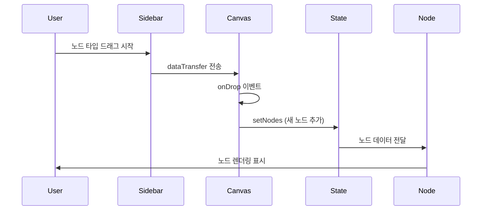
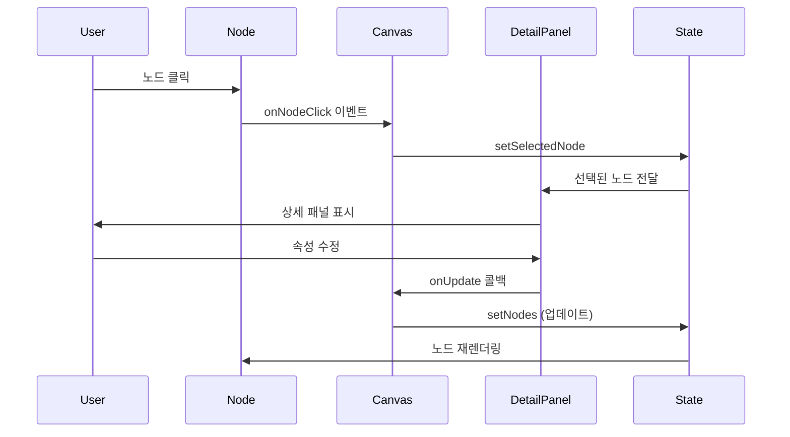
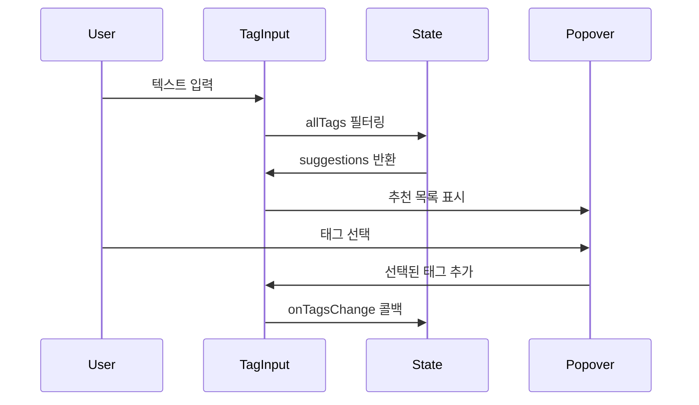
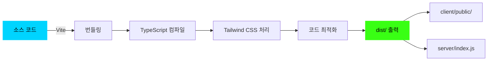
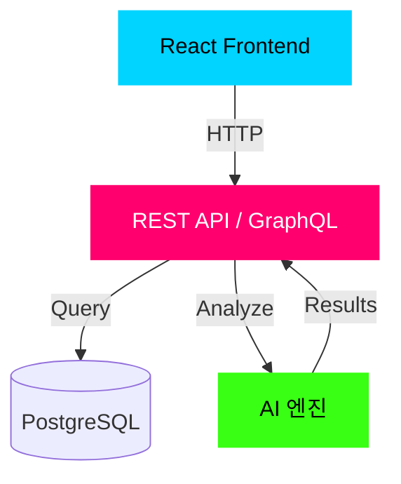

# FlowMatrix 아키텍처 문서

이 문서는 FlowMatrix 프로젝트의 파일 구조, 컴포넌트 관계, 데이터 흐름을 상세히 설명합니다.

## 📂 전체 파일 구조

```
flowmatrix-review/
│
├── 📄 Configuration Files (설정 파일)
│   ├── package.json              # 프로젝트 메타데이터 및 의존성
│   ├── tsconfig.json             # TypeScript 컴파일러 설정
│   ├── tailwind.config.ts        # Tailwind CSS 설정
│   ├── vite.config.ts            # Vite 빌드 도구 설정
│   ├── postcss.config.js         # PostCSS 설정
│   └── .prettierrc               # 코드 포맷팅 규칙
│
├── 📄 Documentation (문서)
│   ├── README.md                 # 프로젝트 개요 및 사용 가이드
│   ├── ARCHITECTURE.md           # 아키텍처 문서 (이 파일)
│   ├── ideas-mvp.md              # 디자인 아이디어 브레인스토밍
│   └── review_report.md          # PRD 검토 보고서
│
├── 📁 client/ (프론트엔드)
│   │
│   ├── 📄 index.html             # HTML 진입점
│   │
│   ├── 📁 public/                # 정적 파일 (빌드 시 복사됨)
│   │   └── images/              # 이미지 에셋
│   │
│   └── 📁 src/                   # 소스 코드
│       │
│       ├── 📄 main.tsx           # React 앱 진입점
│       ├── 📄 App.tsx            # 루트 컴포넌트 (라우팅)
│       ├── 📄 index.css          # 글로벌 스타일 (Tailwind + 커스텀)
│       │
│       ├── 📁 components/        # React 컴포넌트
│       │   ├── 📁 ui/           # shadcn/ui 기본 컴포넌트
│       │   │   ├── button.tsx
│       │   │   ├── card.tsx
│       │   │   ├── input.tsx
│       │   │   ├── select.tsx
│       │   │   ├── badge.tsx
│       │   │   ├── separator.tsx
│       │   │   ├── progress.tsx
│       │   │   ├── label.tsx
│       │   │   ├── command.tsx
│       │   │   ├── popover.tsx
│       │   │   ├── tooltip.tsx
│       │   │   └── ... (기타 UI 컴포넌트)
│       │   │
│       │   ├── WorkflowNode.tsx          # 워크플로우 노드 컴포넌트
│       │   ├── MatrixView.tsx            # 매트릭스 뷰 레이아웃
│       │   ├── NodeDetailPanel.tsx       # 노드 상세 정보 패널
│       │   ├── DraggableNodeType.tsx     # 드래그 가능한 노드 타입 카드
│       │   ├── TagAutocomplete.tsx       # 태그 자동완성 입력
│       │   └── ErrorBoundary.tsx         # 에러 경계 처리
│       │
│       ├── 📁 contexts/          # React Context API
│       │   └── ThemeContext.tsx  # 다크/라이트 테마 관리
│       │
│       ├── 📁 hooks/             # 커스텀 React 훅
│       │   └── (비어있음)
│       │
│       ├── 📁 lib/               # 유틸리티 함수
│       │   └── utils.ts          # 공통 헬퍼 함수 (cn 등)
│       │
│       ├── 📁 pages/             # 페이지 컴포넌트
│       │   ├── WorkflowCanvas.tsx        # 메인 캔버스 페이지
│       │   ├── Home.tsx                  # 검토 보고서 페이지
│       │   └── NotFound.tsx              # 404 에러 페이지
│       │
│       └── 📁 types/             # TypeScript 타입 정의
│           └── workflow.ts       # 워크플로우 관련 타입
│
├── 📁 server/ (백엔드)
│   └── index.ts                  # Express 정적 파일 서버
│
└── 📁 shared/ (공유 코드)
    └── const.ts                  # 프론트/백엔드 공유 상수
```

---

## 🧩 컴포넌트 상세 설명

### 1. 페이지 컴포넌트 (Pages)

#### `WorkflowCanvas.tsx` (메인 페이지)

**역할**: 워크플로우 매핑의 핵심 페이지로, 모든 주요 기능을 통합합니다.

**주요 기능**:
- React Flow 캔버스 렌더링
- 노드 생성, 수정, 삭제
- 연결선 생성 및 관리
- 뷰 모드 전환 (캔버스 ↔ 매트릭스)
- 드래그 앤 드롭 처리
- 상태 관리 (nodes, edges, selectedNode)

**상태 관리**:
```typescript
const [nodes, setNodes, onNodesChange] = useNodesState(initialNodes);
const [edges, setEdges, onEdgesChange] = useEdgesState(initialEdges);
const [selectedNode, setSelectedNode] = useState<ActivityNode | null>(null);
const [viewMode, setViewMode] = useState<"canvas" | "matrix">("canvas");
const [reactFlowInstance, setReactFlowInstance] = useState<any>(null);
```

**렌더링 구조**:
```
WorkflowCanvas
├── Top Toolbar (뷰 전환, 통계, 협업 버튼)
├── Left Sidebar (노드 추가 패널)
│   ├── DraggableNodeType (×4)
│   └── 설정 폼 (드롭다운)
├── NodeDetailPanel (우측 패널)
└── Main Content Area
    ├── ReactFlow Canvas (캔버스 뷰)
    │   ├── WorkflowNode (×N)
    │   ├── Background (그리드)
    │   ├── Controls (줌/팬)
    │   └── MiniMap
    └── MatrixView (매트릭스 뷰)
```

**이벤트 핸들러**:
- `onConnect`: 노드 간 연결 생성
- `onNodeClick`: 노드 클릭 시 상세 패널 표시
- `onDrop`: 드래그 앤 드롭으로 노드 생성
- `addNode`: 버튼 클릭으로 노드 생성
- `handleNodeUpdate`: 노드 속성 업데이트

---

#### `Home.tsx` (보고서 페이지)

**역할**: PRD 검토 보고서를 표시하는 정적 페이지입니다.

**구조**:
- 스티키 네비게이션
- 섹션별 콘텐츠 (개요, 시너지 분석, 개선 제안, 결론)
- 테이블 및 카드 레이아웃

---

### 2. 핵심 컴포넌트 (Core Components)

#### `WorkflowNode.tsx`

**역할**: 개별 워크플로우 노드를 렌더링합니다.

**Props**:
```typescript
interface WorkflowNodeData extends ActivityNode {
  isBottleneck?: boolean;
  aiScore?: number;
}
```

**시각적 요소**:
- 타입별 아이콘 (Trigger, Action, Decision, Artifact)
- 타입별 색상 테두리
- AI 스코어 배지 (70점 이상 시)
- 병목 경고 (펄스 애니메이션)
- 소요 시간 표시
- 창의성 필요도 배지
- 사용 도구 태그
- 반복 작업 인디케이터

**스타일링**:
```css
.brutal-card {
  border: 2px solid;
  box-shadow: 4px 4px 0px 0px rgba(0,212,255,0.3);
}

.pulse-bottleneck {
  animation: pulse-scale 1.5s ease-in-out infinite;
}
```

---

#### `NodeDetailPanel.tsx`

**역할**: 선택된 노드의 상세 정보를 표시하고 편집할 수 있는 패널입니다.

**Props**:
```typescript
interface NodeDetailPanelProps {
  node: ActivityNode | null;
  onClose: () => void;
  onUpdate: (node: ActivityNode) => void;
  allTags: string[];
}
```

**섹션 구성**:
1. **헤더**: 노드명, 부서, 프로젝트 단계
2. **경고 카드**: 병목 또는 AI 대체 가능성 알림
3. **기본 정보**: 작업명, 소요 시간, 창의성 필요도, 담당자
4. **사용 도구**: 도구 목록 배지
5. **온톨로지 태그**: TagAutocomplete 컴포넌트
6. **프로세스 메트릭**: 반복 작업 여부, 노드 타입
7. **액션 버튼**: 분석, 삭제

**조건부 렌더링**:
- `isBottleneck === true`: 붉은색 경고 카드 표시
- `aiScore > 70`: 녹색 AI 대체 가능성 카드 표시

---

#### `MatrixView.tsx`

**역할**: 부서×프로젝트 단계 매트릭스 레이아웃을 렌더링합니다.

**Props**:
```typescript
interface MatrixViewProps {
  nodes: ActivityNode[];
  onNodeClick: (node: ActivityNode) => void;
}
```

**레이아웃 구조**:
```
┌─────────────┬─────────┬─────────┬─────────┬─────────┬─────────┐
│             │  기획   │  개발   │ 테스트  │  배포   │유지보수 │
├─────────────┼─────────┼─────────┼─────────┼─────────┼─────────┤
│ 제품팀      │ [노드]  │         │         │ [노드]  │         │
├─────────────┼─────────┼─────────┼─────────┼─────────┼─────────┤
│ 디자인팀    │ [노드]  │         │         │         │         │
├─────────────┼─────────┼─────────┼─────────┼─────────┼─────────┤
│ HW팀        │         │ [노드]  │         │         │         │
├─────────────┼─────────┼─────────┼─────────┼─────────┼─────────┤
│ SW팀        │         │ [노드]  │         │         │         │
├─────────────┼─────────┼─────────┼─────────┼─────────┼─────────┤
│ QA팀        │         │         │ [노드]  │         │         │
├─────────────┼─────────┼─────────┼─────────┼─────────┼─────────┤
│ 마케팅팀    │         │         │         │ [노드]  │         │
└─────────────┴─────────┴─────────┴─────────┴─────────┴─────────┘
```

**핵심 로직**:
```typescript
const getNodesForCell = (department: Department, stage: ProjectStage) => {
  return nodes.filter(
    (node) => node.department === department && node.stage === stage
  );
};
```

---

#### `DraggableNodeType.tsx`

**역할**: 좌측 패널에서 캔버스로 드래그 가능한 노드 타입 카드입니다.

**Props**:
```typescript
interface DraggableNodeTypeProps {
  type: NodeType;
  label: string;
  icon: LucideIcon;
  colorClass: string;
}
```

**드래그 이벤트**:
```typescript
const onDragStart = (event: React.DragEvent) => {
  event.dataTransfer.setData("application/reactflow", type);
  event.dataTransfer.effectAllowed = "move";
};
```

**시각적 피드백**:
- `cursor-grab`: 드래그 가능 상태
- `active:cursor-grabbing`: 드래그 중
- `hover:scale-105`: 호버 시 확대

---

#### `TagAutocomplete.tsx`

**역할**: 온톨로지 태그 입력 시 자동완성을 제공합니다.

**Props**:
```typescript
interface TagAutocompleteProps {
  selectedTags: string[];
  onTagsChange: (tags: string[]) => void;
  allTags: string[];
}
```

**자동완성 로직**:
```typescript
const suggestions = useMemo(() => {
  if (!inputValue) return allTags.filter(tag => !selectedTags.includes(tag)).slice(0, 5);
  
  const filtered = allTags.filter(
    tag => 
      !selectedTags.includes(tag) && 
      tag.toLowerCase().includes(inputValue.toLowerCase())
  );
  
  return filtered.slice(0, 5);
}, [inputValue, allTags, selectedTags]);
```

**기능**:
- 입력 시 실시간 추천 (최대 5개)
- Enter 키로 태그 추가
- `#` 자동 추가 (없을 경우)
- X 버튼으로 태그 제거

---

### 3. UI 컴포넌트 (shadcn/ui)

`client/src/components/ui/` 디렉토리에는 shadcn/ui 기반의 재사용 가능한 UI 컴포넌트가 있습니다.

#### 주요 컴포넌트

| 컴포넌트 | 용도 | 사용 예시 |
|---------|------|----------|
| `button.tsx` | 버튼 | 노드 추가, 저장, 협업 |
| `card.tsx` | 카드 컨테이너 | 노드, 패널, 통계 |
| `input.tsx` | 텍스트 입력 | 작업명, 담당자 |
| `select.tsx` | 드롭다운 | 노드 타입, 부서, 단계 |
| `badge.tsx` | 배지 | 도구, 태그, 스코어 |
| `separator.tsx` | 구분선 | 섹션 구분 |
| `progress.tsx` | 진행률 바 | AI 스코어 표시 |
| `command.tsx` | 커맨드 팔레트 | 태그 자동완성 |
| `popover.tsx` | 팝오버 | 자동완성 드롭다운 |
| `tooltip.tsx` | 툴팁 | 아이콘 설명 |

#### 컴포넌트 사용 예시

```tsx
import { Button } from "@/components/ui/button";
import { Card, CardContent, CardHeader, CardTitle } from "@/components/ui/card";

<Card className="brutal-card">
  <CardHeader>
    <CardTitle>노드 상세</CardTitle>
  </CardHeader>
  <CardContent>
    <Button variant="default">저장</Button>
  </CardContent>
</Card>
```

---

## 🔄 데이터 흐름

### 노드 생성 플로우



### 노드 편집 플로우



### 태그 자동완성 플로우



---

## 🎨 스타일링 시스템

### Tailwind CSS 설정

`tailwind.config.ts`:
```typescript
export default {
  content: ["./client/**/*.{ts,tsx}"],
  theme: {
    extend: {
      colors: {
        primary: "var(--primary)",
        accent: "var(--accent)",
        // ...
      },
      fontFamily: {
        display: ["Space Grotesk", "sans-serif"],
        body: ["Inter", "sans-serif"],
        mono: ["JetBrains Mono", "monospace"],
      },
    },
  },
};
```

### 글로벌 스타일

`client/src/index.css`:

**색상 변수 (OKLCH)**:
```css
:root {
  --primary: oklch(0.65 0.25 230);      /* 사이버 블루 */
  --accent: oklch(0.60 0.30 350);       /* 네온 핑크 */
  --success: oklch(0.75 0.25 130);      /* 라임 그린 */
  --background: oklch(0.08 0.01 260);   /* 다크 배경 */
  --foreground: oklch(0.95 0.01 260);   /* 밝은 텍스트 */
}
```

**커스텀 클래스**:
```css
.brutal-card {
  @apply border-2 border-primary bg-card rounded-sm 
         shadow-[4px_4px_0px_0px_rgba(0,212,255,0.3)];
}

.neon-glow {
  box-shadow: 0 0 10px currentColor, 
              0 0 20px currentColor, 
              0 0 30px currentColor;
}

.pulse-bottleneck {
  animation: pulse-scale 1.5s ease-in-out infinite;
}

.grid-background {
  background-image: 
    linear-gradient(to right, oklch(0.15 0.01 260) 1px, transparent 1px),
    linear-gradient(to bottom, oklch(0.15 0.01 260) 1px, transparent 1px);
  background-size: 40px 40px;
}
```

---

## 🔧 TypeScript 타입 시스템

### `client/src/types/workflow.ts`

**노드 타입**:
```typescript
export type NodeType = "TRIGGER" | "ACTION" | "DECISION" | "ARTIFACT";
```

**부서 타입**:
```typescript
export type Department = 
  | "HW_TEAM" 
  | "SW_TEAM" 
  | "DESIGN_TEAM" 
  | "QA_TEAM" 
  | "PRODUCT_TEAM"
  | "MARKETING_TEAM";
```

**프로젝트 단계**:
```typescript
export type ProjectStage = 
  | "PLANNING" 
  | "DEVELOPMENT" 
  | "TESTING" 
  | "DEPLOYMENT" 
  | "MAINTENANCE";
```

**활동 노드 인터페이스**:
```typescript
export interface ActivityNode {
  id: string;
  type: NodeType;
  label: string;
  stage: ProjectStage;
  department: Department;
  attributes: {
    tool: string[];
    avg_time: string;
    is_repetitive: boolean;
    brain_usage: BrainUsage;
    assignee?: string;
  };
  ontology_tags: string[];
  position: { x: number; y: number };
}
```

**워크플로우 관계**:
```typescript
export interface WorkflowRelationship {
  id: string;
  source: string;
  target: string;
  relation_type: RelationType;
  properties: {
    lag_time?: string;
    condition?: string;
  };
}
```

---

## 🚀 빌드 및 배포

### Vite 설정

`vite.config.ts`:
```typescript
export default defineConfig({
  plugins: [
    react(),
    tailwindcss(),
    manusRuntime(),
  ],
  resolve: {
    alias: {
      "@": path.resolve(__dirname, "./client/src"),
    },
  },
  server: {
    port: 3000,
    host: true,
  },
});
```

### 빌드 프로세스



**빌드 명령어**:
```bash
pnpm build
# 1. Vite가 client/ 빌드 → dist/public/
# 2. esbuild가 server/ 빌드 → dist/index.js
```

**실행**:
```bash
pnpm start
# dist/index.js 실행 (Express 서버)
# dist/public/ 정적 파일 서빙
```

---

## 📊 성능 최적화

### React 최적화

1. **메모이제이션**:
```typescript
const WorkflowNode = memo(({ data }: NodeProps<WorkflowNodeData>) => {
  // 노드 데이터가 변경될 때만 재렌더링
});
```

2. **useMemo로 계산 캐싱**:
```typescript
const allTags = useMemo(() => {
  const tagSet = new Set<string>();
  nodes.forEach((node) => {
    node.data.ontology_tags.forEach((tag) => tagSet.add(tag));
  });
  return Array.from(tagSet);
}, [nodes]);
```

3. **useCallback으로 함수 안정화**:
```typescript
const onConnect = useCallback(
  (params: Connection) => {
    setEdges((eds) => addEdge(params, eds));
  },
  [setEdges]
);
```

### React Flow 최적화

- `fitView`: 초기 렌더링 시 자동 줌 조정
- `nodeTypes`: 노드 타입을 컴포넌트 외부에 정의하여 재생성 방지
- `defaultEdgeOptions`: 연결선 기본 옵션 캐싱

---

## 🧪 테스트 전략

### 컴포넌트 테스트

**WorkflowNode 테스트**:
```typescript
describe("WorkflowNode", () => {
  it("should render node with correct type icon", () => {
    // 타입별 아이콘 렌더링 확인
  });
  
  it("should show bottleneck animation when isBottleneck is true", () => {
    // 병목 펄스 애니메이션 확인
  });
  
  it("should display AI score badge when score > 70", () => {
    // AI 스코어 배지 표시 확인
  });
});
```

### 통합 테스트

**드래그 앤 드롭 플로우**:
```typescript
describe("Drag and Drop", () => {
  it("should create node when dropped on canvas", () => {
    // 1. 노드 타입 드래그 시작
    // 2. 캔버스에 드롭
    // 3. 새 노드 생성 확인
  });
});
```

---

## 🔒 보안 고려사항

### XSS 방지

- React의 자동 이스케이핑 활용
- `dangerouslySetInnerHTML` 사용 금지
- 사용자 입력 검증

### 타입 안정성

- TypeScript strict 모드 활성화
- 모든 props에 타입 정의
- `any` 타입 최소화

---

## 📈 향후 확장 가능성

### 백엔드 통합

현재는 프론트엔드 전용이지만, 다음과 같이 확장 가능합니다:



### 실시간 협업

WebSocket을 통한 실시간 협업 기능:

```typescript
// 예상 구조
const socket = io("wss://api.flowmatrix.com");

socket.on("node:update", (node) => {
  setNodes((nds) => nds.map((n) => n.id === node.id ? node : n));
});

socket.emit("node:create", newNode);
```

---

**문서 작성자**: Manus AI  
**최종 업데이트**: 2026-01-10
