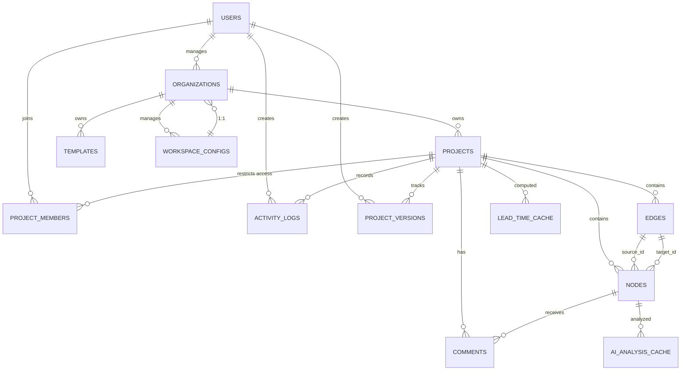

# FlowMatrix Phase 8: Database Design Documentation

## 1. Executive Summary

Phase 8 marks FlowMatrix's transition from a client-side LocalStorage implementation to a robust, scalable backend architecture with PostgreSQL and Prisma ORM. This document provides comprehensive database design specifications for enterprise-grade workflow management.

### Current State (Phase 7)
- **Storage**: LocalStorage (5-10MB limit, single browser)
- **Data**: In-memory JSON objects with no persistence layer
- **Limitations**: No multi-user support, no audit trail, no real-time collaboration

### Phase 8 Objectives
1. **Persistent Database**: Move from ephemeral LocalStorage to durable PostgreSQL
2. **Multi-Tenancy**: Support multiple organizations with data isolation
3. **Scalability**: Handle 10K+ projects, 100K+ nodes at enterprise scale
4. **Collaboration**: Foundation for real-time multi-user editing (Phase 9)
5. **Compliance**: Audit trails, soft deletes, GDPR-ready architecture
6. **Performance**: Optimized indexes, query caching, denormalized fields

### Technology Stack
- **Database**: PostgreSQL 15+ (ACID compliance, JSON support, full-text search)
- **ORM**: Prisma (type-safe queries, auto migrations, seed management)
- **API**: Express.js (REST/GraphQL ready)
- **Authentication**: JWT (RS256 signing, refresh token rotation)
- **Real-time**: WebSocket foundation (Socket.io implementation in Phase 9)
- **Caching**: Redis (optional, for performance optimization)

### Estimated Implementation
- **Duration**: 4-6 weeks
- **Team**: 2-3 backend engineers + 1 database specialist
- **Testing**: 40% coverage (unit + integration + E2E)
- **Deployment**: Blue-green strategy with zero-downtime migration

### Success Criteria
✓ All Phase 7 features persisted and queryable
✓ Multi-tenant data isolation verified
✓ Query response times < 200ms (p95)
✓ Zero data loss during LocalStorage migration
✓ 99.9% uptime on production database
✓ GDPR compliance ready (right to be forgotten)

---

## 2. Technology Stack Rationale

### PostgreSQL 15+
**Why PostgreSQL?**
- ACID guarantees (data integrity)
- JSON/JSONB support (flexible schema for node attributes)
- Full-text search for workflow analysis
- Enum types (status, node_type, relation_type)
- Window functions for analytics (lead time calculation)
- Foreign key constraints for referential integrity
- Native UUID support (no storage overhead)

**Key Features Used**:
```sql
-- JSONB columns for flexibility
- organizations.settings JSONB
- nodes.attributes JSONB
- templates.nodes JSONB

-- Enums for type safety
- NodeType: TRIGGER, ACTION, DECISION, ARTIFACT
- NodeStatus: PENDING, READY, IN_PROGRESS, COMPLETED, BLOCKED
- RelationType: REQUIRES, BLOCKS, FEEDBACK_TO

-- Window functions for analytics
- ROW_NUMBER() for pagination
- RANK() for lead time calculations
- aggregate() for department/stage summaries
```

### Prisma ORM
**Why Prisma over SQLAlchemy/Sequelize?**
- Type-safe queries (Prisma Client generated from schema)
- Zero-cost abstractions (compiles to raw SQL)
- Built-in migration system (git-friendly)
- Seeding with TypeScript/JSON
- Excellent TypeScript support

**Prisma Features**:
```prisma
// Automatic relations
model Project {
  nodes Node[]  // 1:N relationship
  edges Edge[]
}

// Composite indexes
@@index([projectId, status])

// Soft deletes
deletedAt DateTime?

// Default values
createdAt DateTime @default(now())
```

### Express.js
**Rationale**: Lightweight, fast, perfect for JSON APIs. Middleware ecosystem for auth, validation, logging.

### JWT Authentication
**Stateless**: No session storage required
**Scalable**: Works across multiple API instances
**Refresh Tokens**: 7-day access tokens, 30-day refresh tokens

### Redis Caching (Optional, Phase 8.2)
**Use cases**:
- Template popularity scoring
- AI score caching (expensive computation)
- Lead time results (cache for 1 hour)
- User session management

---

## 3. Entity Relationship Diagram (ERD)



**Key Relationships**:
1. **Users → Organizations (1:N)**: User manages multiple orgs (admin)
2. **Organizations → Projects (1:N)**: Org owns multiple projects
3. **Organizations → Templates (1:N)**: Shared templates within org
4. **Projects → Nodes (1:N)**: Project canvas contains nodes
5. **Projects → Edges (1:N)**: Edges connect nodes
6. **Nodes → Edges (1:N)**: Node can be source/target of multiple edges
7. **Projects → ProjectMembers (1:N)**: Role-based access control
8. **Projects → ProjectVersions (1:N)**: Version history tracking

---

## 4. Table Definitions (13 Core Tables)

### Table 1: `users`
**Purpose**: User authentication and profile management
**Soft Delete**: Yes (deleted_at)

```sql
CREATE TABLE users (
  -- Primary Key
  id UUID PRIMARY KEY DEFAULT gen_random_uuid(),

  -- Authentication
  email VARCHAR(255) UNIQUE NOT NULL,
  password_hash VARCHAR(255) NOT NULL,

  -- Profile
  name VARCHAR(255) NOT NULL,
  avatar_url VARCHAR(500),
  bio TEXT,

  -- Role & Permissions
  role ENUM('ADMIN', 'USER') DEFAULT 'USER' NOT NULL,

  -- Metadata
  created_at TIMESTAMP DEFAULT CURRENT_TIMESTAMP NOT NULL,
  updated_at TIMESTAMP DEFAULT CURRENT_TIMESTAMP NOT NULL,
  deleted_at TIMESTAMP,

  -- Indexes
  CONSTRAINT email_lower CHECK (email = LOWER(email)),
  INDEX idx_users_email (email),
  INDEX idx_users_deleted_at (deleted_at)
);
```

**Fields**:
- `id`: UUID primary key (no auto-increment)
- `email`: Unique, case-insensitive, indexed for login
- `password_hash`: bcrypt(12 rounds), never return in API
- `role`: Global role (ADMIN = manage users/orgs)
- `deleted_at`: NULL = active, timestamp = soft deleted
- `created_at`, `updated_at`: Standard audit timestamps

---

### Table 2: `organizations`
**Purpose**: Multi-tenant workspace isolation
**Soft Delete**: Yes
**JSONB Fields**: settings (departments, stages, theme)

```sql
CREATE TABLE organizations (
  id UUID PRIMARY KEY DEFAULT gen_random_uuid(),

  -- Identity
  name VARCHAR(255) NOT NULL,
  slug VARCHAR(100) UNIQUE NOT NULL,  -- URL-safe identifier
  description TEXT,
  logo_url VARCHAR(500),

  -- Configuration (JSONB)
  settings JSONB DEFAULT '{
    "departments": [],
    "stages": [],
    "theme_color": "#00D4FF",
    "max_projects": 100,
    "max_members": 50
  }' NOT NULL,

  -- Audit
  created_by UUID NOT NULL REFERENCES users(id) ON DELETE RESTRICT,
  created_at TIMESTAMP DEFAULT CURRENT_TIMESTAMP NOT NULL,
  updated_at TIMESTAMP DEFAULT CURRENT_TIMESTAMP NOT NULL,
  deleted_at TIMESTAMP,

  CONSTRAINT slug_lowercase CHECK (slug = LOWER(slug)),
  CONSTRAINT slug_valid CHECK (slug ~ '^[a-z0-9-]+$'),
  FOREIGN KEY (created_by) REFERENCES users(id) ON DELETE RESTRICT
);

CREATE INDEX idx_organizations_created_by ON organizations(created_by);
CREATE INDEX idx_organizations_slug ON organizations(slug);
```

**Settings Structure**:
```json
{
  "departments": [
    { "id": "dept_1", "name": "Engineering", "color": "#00D4FF", "order": 1 },
    { "id": "dept_2", "name": "Marketing", "color": "#FF00FF", "order": 2 }
  ],
  "stages": [
    { "id": "stage_1", "name": "Planning", "color": "#00FF88", "order": 1 },
    { "id": "stage_2", "name": "Development", "color": "#00D4FF", "order": 2 }
  ],
  "theme_color": "#00D4FF",
  "max_projects": 100,
  "max_members": 50
}
```

---

### Table 3: `projects`
**Purpose**: Workflow project metadata and status
**Soft Delete**: Yes
**Denormalization**: nodes_count (for performance)

```sql
CREATE TABLE projects (
  id UUID PRIMARY KEY DEFAULT gen_random_uuid(),

  -- Association
  organization_id UUID NOT NULL REFERENCES organizations(id) ON DELETE CASCADE,

  -- Identity
  name VARCHAR(255) NOT NULL,
  description TEXT,
  slug VARCHAR(100) NOT NULL,  -- Unique per organization

  -- Status
  status ENUM('ACTIVE', 'ARCHIVED', 'DELETED') DEFAULT 'ACTIVE' NOT NULL,

  -- Denormalized counts (updated via trigger)
  nodes_count INT DEFAULT 0 NOT NULL,
  edges_count INT DEFAULT 0 NOT NULL,

  -- Audit
  created_by UUID NOT NULL REFERENCES users(id) ON DELETE SET NULL,
  created_at TIMESTAMP DEFAULT CURRENT_TIMESTAMP NOT NULL,
  updated_at TIMESTAMP DEFAULT CURRENT_TIMESTAMP NOT NULL,
  deleted_at TIMESTAMP,

  UNIQUE(organization_id, slug),
  CONSTRAINT slug_lowercase CHECK (slug = LOWER(slug)),
  FOREIGN KEY (created_by) REFERENCES users(id)
);

CREATE INDEX idx_projects_organization_id ON projects(organization_id);
CREATE INDEX idx_projects_created_by ON projects(created_by);
CREATE INDEX idx_projects_status ON projects(status);
```

---

### Table 4: `project_members`
**Purpose**: Role-based access control per project
**Pattern**: Join table for many-to-many with role

```sql
CREATE TABLE project_members (
  id UUID PRIMARY KEY DEFAULT gen_random_uuid(),

  -- Relationship
  project_id UUID NOT NULL REFERENCES projects(id) ON DELETE CASCADE,
  user_id UUID NOT NULL REFERENCES users(id) ON DELETE CASCADE,

  -- Authorization
  role ENUM('OWNER', 'EDITOR', 'VIEWER', 'COMMENTER') DEFAULT 'VIEWER' NOT NULL,

  -- Optional permissions override
  permissions JSONB,

  -- Audit
  joined_at TIMESTAMP DEFAULT CURRENT_TIMESTAMP NOT NULL,
  invited_by UUID REFERENCES users(id) ON DELETE SET NULL,

  UNIQUE(project_id, user_id),
  FOREIGN KEY (invited_by) REFERENCES users(id)
);

CREATE INDEX idx_project_members_project_user ON project_members(project_id, user_id);
CREATE INDEX idx_project_members_user_id ON project_members(user_id);
```

**Role Permissions**:
```json
{
  "OWNER": ["create", "read", "update", "delete", "share", "export", "delete_project"],
  "EDITOR": ["create", "read", "update", "export"],
  "VIEWER": ["read"],
  "COMMENTER": ["read", "create_comment"]
}
```

---

### Table 5: `nodes`
**Purpose**: Workflow task nodes (TRIGGER, ACTION, DECISION, ARTIFACT)
**Soft Delete**: Yes
**JSONB Fields**: attributes (tool, time, assignee)
**Denormalization**: AI score for fast filtering

```sql
CREATE TABLE nodes (
  id UUID PRIMARY KEY DEFAULT gen_random_uuid(),

  -- Association
  project_id UUID NOT NULL REFERENCES projects(id) ON DELETE CASCADE,

  -- Identity
  label VARCHAR(255) NOT NULL,
  description TEXT,
  type ENUM('TRIGGER', 'ACTION', 'DECISION', 'ARTIFACT') NOT NULL,

  -- Canvas Position
  position_x INT NOT NULL,
  position_y INT NOT NULL,

  -- Categorization
  stage VARCHAR(100),  -- Foreign key to org.settings.stages[].id
  department VARCHAR(100),  -- Foreign key to org.settings.departments[].id

  -- Execution State
  status ENUM('PENDING', 'READY', 'IN_PROGRESS', 'COMPLETED', 'BLOCKED') DEFAULT 'PENDING' NOT NULL,
  started_at TIMESTAMP,
  completed_at TIMESTAMP,
  progress INT DEFAULT 0 CHECK (progress BETWEEN 0 AND 100),

  -- Node Attributes (JSONB)
  attributes JSONB DEFAULT '{
    "tool": [],
    "avg_time": "2h",
    "is_repetitive": false,
    "brain_usage": "MEDIUM",
    "assignee": null
  }' NOT NULL,

  -- Ontology Tags
  ontology_tags TEXT[] DEFAULT '{}' NOT NULL,

  -- Analysis Results
  ai_score INT DEFAULT 0 CHECK (ai_score BETWEEN 0 AND 100),
  is_bottleneck BOOLEAN DEFAULT FALSE,
  bottleneck_severity ENUM('LOW', 'MEDIUM', 'HIGH', 'CRITICAL'),

  -- Audit
  created_at TIMESTAMP DEFAULT CURRENT_TIMESTAMP NOT NULL,
  updated_at TIMESTAMP DEFAULT CURRENT_TIMESTAMP NOT NULL,
  deleted_at TIMESTAMP,

  FOREIGN KEY (project_id) REFERENCES projects(id) ON DELETE CASCADE
);

CREATE INDEX idx_nodes_project_id ON nodes(project_id);
CREATE INDEX idx_nodes_stage_department ON nodes(stage, department);
CREATE INDEX idx_nodes_status ON nodes(status);
CREATE INDEX idx_nodes_ai_score ON nodes(ai_score DESC);
CREATE INDEX idx_nodes_is_bottleneck ON nodes(is_bottleneck);
```

**Attributes Structure**:
```json
{
  "tool": ["Jira", "Slack"],
  "avg_time": "2h30m",
  "is_repetitive": true,
  "brain_usage": "LOW",  // LOW, MEDIUM, HIGH
  "assignee": "user_id or email"
}
```

---

### Table 6: `edges`
**Purpose**: Workflow relationships and dependencies between nodes
**Cascade**: DELETE when source/target node deleted
**JSONB Fields**: properties (lag_time, condition)

```sql
CREATE TABLE edges (
  id UUID PRIMARY KEY DEFAULT gen_random_uuid(),

  -- Association
  project_id UUID NOT NULL REFERENCES projects(id) ON DELETE CASCADE,
  source_id UUID NOT NULL REFERENCES nodes(id) ON DELETE CASCADE,
  target_id UUID NOT NULL REFERENCES nodes(id) ON DELETE CASCADE,

  -- Relationship Type
  relation_type ENUM('REQUIRES', 'BLOCKS', 'FEEDBACK_TO') NOT NULL,

  -- Properties
  properties JSONB DEFAULT '{}' NOT NULL,

  -- Audit
  created_at TIMESTAMP DEFAULT CURRENT_TIMESTAMP NOT NULL,

  -- Constraints
  CONSTRAINT source_not_equal_target CHECK (source_id != target_id),
  FOREIGN KEY (source_id) REFERENCES nodes(id) ON DELETE CASCADE,
  FOREIGN KEY (target_id) REFERENCES nodes(id) ON DELETE CASCADE
);

CREATE INDEX idx_edges_project_id ON edges(project_id);
CREATE INDEX idx_edges_source_target ON edges(source_id, target_id);
CREATE INDEX idx_edges_relation_type ON edges(relation_type);
```

**Properties Structure**:
```json
{
  "lag_time": "3d",  // Days/hours delay between tasks
  "frequency": 5,     // For FEEDBACK_TO edges, loops per cycle
  "condition": "if customer approves"
}
```

---

### Table 7: `templates`
**Purpose**: Reusable workflow templates (SW_DEV, HW_DEV, MARKETING, DESIGN)
**Snapshot**: nodes/edges stored as JSONB for versioning
**Denormalization**: usage_count for trending

```sql
CREATE TABLE templates (
  id UUID PRIMARY KEY DEFAULT gen_random_uuid(),

  -- Association
  organization_id UUID NOT NULL REFERENCES organizations(id) ON DELETE CASCADE,

  -- Identity
  name VARCHAR(255) NOT NULL,
  description TEXT,
  category ENUM('SW_DEVELOPMENT', 'HW_DEVELOPMENT', 'MARKETING', 'DESIGN', 'CUSTOM') NOT NULL,

  -- Metadata
  tags TEXT[] DEFAULT '{}' NOT NULL,
  thumbnail_url VARCHAR(500),

  -- Template Data (snapshots)
  nodes JSONB NOT NULL,  -- ActivityNode[]
  edges JSONB NOT NULL,  -- WorkflowRelationship[]

  -- Analytics
  usage_count INT DEFAULT 0 NOT NULL,

  -- Audit
  created_by UUID NOT NULL REFERENCES users(id) ON DELETE SET NULL,
  created_at TIMESTAMP DEFAULT CURRENT_TIMESTAMP NOT NULL,
  updated_at TIMESTAMP DEFAULT CURRENT_TIMESTAMP NOT NULL,
  deleted_at TIMESTAMP,

  FOREIGN KEY (created_by) REFERENCES users(id)
);

CREATE INDEX idx_templates_organization_id ON templates(organization_id);
CREATE INDEX idx_templates_category ON templates(category);
CREATE INDEX idx_templates_usage_count ON templates(usage_count DESC);
```

---

### Table 8: `project_versions`
**Purpose**: Version history and audit trail for projects
**Snapshot**: Complete nodes/edges state at each version

```sql
CREATE TABLE project_versions (
  id UUID PRIMARY KEY DEFAULT gen_random_uuid(),

  -- Association
  project_id UUID NOT NULL REFERENCES projects(id) ON DELETE CASCADE,

  -- Version Info
  version_number INT NOT NULL,  -- Auto-increment per project
  comment VARCHAR(500),

  -- Snapshot
  snapshot JSONB NOT NULL,  -- { nodes: [], edges: [], timestamp }

  -- Audit
  created_by UUID NOT NULL REFERENCES users(id) ON DELETE SET NULL,
  created_at TIMESTAMP DEFAULT CURRENT_TIMESTAMP NOT NULL,

  UNIQUE(project_id, version_number),
  FOREIGN KEY (created_by) REFERENCES users(id)
);

CREATE INDEX idx_project_versions_project_id ON project_versions(project_id);
CREATE INDEX idx_project_versions_version_number ON project_versions(project_id, version_number DESC);
```

**Snapshot Structure**:
```json
{
  "nodes": [
    {
      "id": "node_123",
      "type": "ACTION",
      "label": "Process Payment",
      "status": "COMPLETED",
      ...
    }
  ],
  "edges": [...],
  "timestamp": "2024-01-15T10:30:00Z"
}
```

---

### Table 9: `comments`
**Purpose**: Node-level comments and collaboration
**Resolve**: Comments can be marked resolved

```sql
CREATE TABLE comments (
  id UUID PRIMARY KEY DEFAULT gen_random_uuid(),

  -- Association
  node_id UUID NOT NULL REFERENCES nodes(id) ON DELETE CASCADE,
  project_id UUID NOT NULL REFERENCES projects(id) ON DELETE CASCADE,

  -- Author
  user_id UUID NOT NULL REFERENCES users(id) ON DELETE SET NULL,

  -- Content
  content TEXT NOT NULL,

  -- Status
  resolved BOOLEAN DEFAULT FALSE NOT NULL,
  resolved_at TIMESTAMP,
  resolved_by UUID REFERENCES users(id) ON DELETE SET NULL,

  -- Audit
  created_at TIMESTAMP DEFAULT CURRENT_TIMESTAMP NOT NULL,
  updated_at TIMESTAMP DEFAULT CURRENT_TIMESTAMP NOT NULL,

  FOREIGN KEY (node_id) REFERENCES nodes(id) ON DELETE CASCADE,
  FOREIGN KEY (user_id) REFERENCES users(id),
  FOREIGN KEY (resolved_by) REFERENCES users(id)
);

CREATE INDEX idx_comments_node_id ON comments(node_id);
CREATE INDEX idx_comments_project_id ON comments(project_id);
CREATE INDEX idx_comments_resolved ON comments(resolved);
```

---

### Table 10: `ai_analysis_cache`
**Purpose**: Cache expensive AI score calculations
**TTL**: Expires after 30 days (manual cleanup or via trigger)

```sql
CREATE TABLE ai_analysis_cache (
  id UUID PRIMARY KEY DEFAULT gen_random_uuid(),

  -- Association
  node_id UUID NOT NULL UNIQUE REFERENCES nodes(id) ON DELETE CASCADE,

  -- Results
  score INT NOT NULL CHECK (score BETWEEN 0 AND 100),
  reasoning JSONB NOT NULL,  -- { repetitiveness, brain_usage, rule_based, tool_available }

  -- Caching
  computed_at TIMESTAMP DEFAULT CURRENT_TIMESTAMP NOT NULL,
  expires_at TIMESTAMP NOT NULL,  -- computed_at + INTERVAL 30 days

  FOREIGN KEY (node_id) REFERENCES nodes(id) ON DELETE CASCADE
);

CREATE INDEX idx_ai_analysis_cache_node_id ON ai_analysis_cache(node_id);
CREATE INDEX idx_ai_analysis_cache_expires_at ON ai_analysis_cache(expires_at);
```

**Reasoning Structure**:
```json
{
  "repetitiveness": 85,  // 0-100 score
  "brain_usage": "LOW",  // LOW, MEDIUM, HIGH
  "rule_based": true,
  "tool_available": true,
  "final_score": 78
}
```

---

### Table 11: `lead_time_cache`
**Purpose**: Cache computed lead time analysis results
**TTL**: Expires after 1 hour (real-time recalculation on significant changes)

```sql
CREATE TABLE lead_time_cache (
  id UUID PRIMARY KEY DEFAULT gen_random_uuid(),

  -- Association
  project_id UUID NOT NULL UNIQUE REFERENCES projects(id) ON DELETE CASCADE,

  -- Results
  result JSONB NOT NULL,

  -- Caching
  computed_at TIMESTAMP DEFAULT CURRENT_TIMESTAMP NOT NULL,
  expires_at TIMESTAMP NOT NULL,  -- computed_at + INTERVAL 1 hour

  FOREIGN KEY (project_id) REFERENCES projects(id) ON DELETE CASCADE
);

CREATE INDEX idx_lead_time_cache_project_id ON lead_time_cache(project_id);
CREATE INDEX idx_lead_time_cache_expires_at ON lead_time_cache(expires_at);
```

**Result Structure**:
```json
{
  "totalMinutes": 312,
  "totalHours": 5.2,
  "totalDays": 0.22,
  "formatted": "5h 12m",
  "criticalPath": ["node_1", "node_3", "node_7"],
  "stageBreakdown": {
    "Planning": 60,
    "Development": 180,
    "Testing": 72
  },
  "departmentBreakdown": {
    "Engineering": 252,
    "QA": 60
  }
}
```

---

### Table 12: `activity_logs`
**Purpose**: Audit trail for all modifications
**Entity Types**: NODE, EDGE, PROJECT, TEMPLATE, COMMENT
**Actions**: CREATE, UPDATE, DELETE, EXPORT, SHARE

```sql
CREATE TABLE activity_logs (
  id UUID PRIMARY KEY DEFAULT gen_random_uuid(),

  -- Association
  project_id UUID NOT NULL REFERENCES projects(id) ON DELETE CASCADE,
  user_id UUID REFERENCES users(id) ON DELETE SET NULL,

  -- Action Details
  action ENUM('CREATE', 'UPDATE', 'DELETE', 'EXPORT', 'SHARE', 'RESTORE') NOT NULL,
  entity_type ENUM('NODE', 'EDGE', 'PROJECT', 'TEMPLATE', 'COMMENT') NOT NULL,
  entity_id UUID,  -- Reference to modified entity (nullable if deleted)

  -- Change Details
  details JSONB NOT NULL,  -- { old_value, new_value, reason, fields_changed }

  -- Audit
  ip_address VARCHAR(45),  -- IPv4/IPv6
  user_agent TEXT,
  created_at TIMESTAMP DEFAULT CURRENT_TIMESTAMP NOT NULL,

  FOREIGN KEY (project_id) REFERENCES projects(id) ON DELETE CASCADE,
  FOREIGN KEY (user_id) REFERENCES users(id) ON DELETE SET NULL
);

CREATE INDEX idx_activity_logs_project_id ON activity_logs(project_id);
CREATE INDEX idx_activity_logs_user_id ON activity_logs(user_id);
CREATE INDEX idx_activity_logs_entity_id ON activity_logs(entity_id);
CREATE INDEX idx_activity_logs_created_at ON activity_logs(created_at DESC);
```

**Details Structure**:
```json
{
  "old_value": {
    "label": "Process Order",
    "status": "PENDING"
  },
  "new_value": {
    "label": "Process Order (Updated)",
    "status": "IN_PROGRESS"
  },
  "fields_changed": ["label", "status"],
  "reason": "Approved by stakeholders"
}
```

---

### Table 13: `workspace_configs`
**Purpose**: Centralized department and stage configuration per organization
**Pattern**: 1:1 with organization (extended settings)

```sql
CREATE TABLE workspace_configs (
  id UUID PRIMARY KEY DEFAULT gen_random_uuid(),

  -- Association
  organization_id UUID NOT NULL UNIQUE REFERENCES organizations(id) ON DELETE CASCADE,

  -- Configuration
  departments JSONB NOT NULL DEFAULT '[]',
  stages JSONB NOT NULL DEFAULT '[]',

  -- Audit
  updated_by UUID REFERENCES users(id) ON DELETE SET NULL,
  updated_at TIMESTAMP DEFAULT CURRENT_TIMESTAMP NOT NULL,

  FOREIGN KEY (organization_id) REFERENCES organizations(id),
  FOREIGN KEY (updated_by) REFERENCES users(id)
);

CREATE INDEX idx_workspace_configs_organization_id ON workspace_configs(organization_id);
```

**Configuration Structure**:
```json
{
  "departments": [
    { "id": "eng", "label": "Engineering", "order": 1 },
    { "id": "mkt", "label": "Marketing", "order": 2 }
  ],
  "stages": [
    { "id": "plan", "label": "Planning", "order": 1 },
    { "id": "dev", "label": "Development", "order": 2 },
    { "id": "test", "label": "Testing", "order": 3 }
  ]
}
```

---

## 5. Index Strategy (15+ Indexes)

### Purpose of Indexes
- **Foreign Key Joins**: Enable fast lookups across related tables
- **Filtering**: Support WHERE clauses (status, deleted_at, organization_id)
- **Sorting**: ORDER BY operations on large datasets
- **Search**: Full-text search on node labels
- **Analytics**: Aggregate queries by stage/department

### Complete Index Specification

#### Foreign Key Indexes (10)
These are created automatically by Prisma, but documented here for reference:

```sql
CREATE INDEX idx_organizations_created_by ON organizations(created_by);
CREATE INDEX idx_projects_organization_id ON projects(organization_id);
CREATE INDEX idx_projects_created_by ON projects(created_by);
CREATE INDEX idx_project_members_project_user ON project_members(project_id, user_id);
CREATE INDEX idx_project_members_user_id ON project_members(user_id);
CREATE INDEX idx_nodes_project_id ON nodes(project_id);
CREATE INDEX idx_edges_project_id ON edges(project_id);
CREATE INDEX idx_templates_organization_id ON templates(organization_id);
CREATE INDEX idx_project_versions_project_id ON project_versions(project_id);
CREATE INDEX idx_comments_node_id ON comments(node_id);
```

#### Filtering & Search Indexes (5)
```sql
-- Status-based queries
CREATE INDEX idx_projects_status ON projects(status);
CREATE INDEX idx_nodes_status ON nodes(status);
CREATE INDEX idx_comments_resolved ON comments(resolved);

-- Soft delete queries (fast active record fetching)
CREATE INDEX idx_users_deleted_at ON users(deleted_at);
CREATE INDEX idx_organizations_deleted_at ON organizations(deleted_at);
CREATE INDEX idx_projects_deleted_at ON projects(deleted_at);
CREATE INDEX idx_nodes_deleted_at ON nodes(deleted_at);
```

#### Performance Optimization Indexes (5)
```sql
-- AI score filtering (find automatable tasks)
CREATE INDEX idx_nodes_ai_score ON nodes(ai_score DESC);

-- Bottleneck analysis
CREATE INDEX idx_nodes_is_bottleneck ON nodes(is_bottleneck);

-- Categorization (department/stage matrix view)
CREATE INDEX idx_nodes_stage_department ON nodes(stage, department);

-- Composite index for common join patterns
CREATE INDEX idx_edges_source_target ON edges(source_id, target_id);

-- Template category browsing
CREATE INDEX idx_templates_category ON templates(category);
CREATE INDEX idx_templates_usage_count ON templates(usage_count DESC);
```

#### Analytics Indexes (3)
```sql
-- Activity log queries (recent changes)
CREATE INDEX idx_activity_logs_project_id ON activity_logs(project_id);
CREATE INDEX idx_activity_logs_created_at ON activity_logs(created_at DESC);

-- Version history
CREATE INDEX idx_project_versions_version_number ON project_versions(project_id, version_number DESC);

-- Cache expiration cleanup
CREATE INDEX idx_ai_analysis_cache_expires_at ON ai_analysis_cache(expires_at);
CREATE INDEX idx_lead_time_cache_expires_at ON lead_time_cache(expires_at);
```

#### Full-Text Search Indexes (Optional, Phase 8.2)
```sql
-- For advanced search feature
CREATE EXTENSION IF NOT EXISTS pg_trgm;
CREATE INDEX idx_nodes_label_trgm ON nodes USING GIST(label gist_trgm_ops);
CREATE INDEX idx_projects_name_trgm ON projects USING GIST(name gist_trgm_ops);
```

### Index Maintenance Strategy
```sql
-- Analyze query performance
EXPLAIN ANALYZE SELECT * FROM nodes WHERE project_id = '...' AND status = 'PENDING';

-- Identify unused indexes
SELECT * FROM pg_stat_user_indexes WHERE idx_scan = 0;

-- Vacuum and analyze
VACUUM ANALYZE;  -- Run weekly

-- Index bloat detection
SELECT * FROM pg_stat_user_indexes WHERE idx_blks_read > 1000;
```

---

## 6. Query Optimization Examples

### Query 1: Load Full Project with Dependencies
**Purpose**: Render canvas page with all nodes and edges
**Expected Time**: < 100ms

```sql
-- Single query with JOIN to avoid N+1
SELECT
  p.*,
  COUNT(DISTINCT n.id) as node_count,
  COUNT(DISTINCT e.id) as edge_count,
  array_agg(DISTINCT n.id) as node_ids
FROM projects p
LEFT JOIN nodes n ON p.id = n.project_id AND n.deleted_at IS NULL
LEFT JOIN edges e ON p.id = e.project_id
WHERE p.id = $1 AND p.deleted_at IS NULL
GROUP BY p.id;

-- Then fetch nodes in separate query (Prisma's DataLoader pattern)
SELECT * FROM nodes
WHERE project_id = $1 AND deleted_at IS NULL
ORDER BY created_at DESC;

-- And edges
SELECT * FROM edges WHERE project_id = $1;
```

**Prisma Equivalent**:
```typescript
const project = await prisma.project.findUnique({
  where: { id: projectId },
  include: {
    nodes: { where: { deletedAt: null } },
    edges: true,
    projectMembers: { include: { user: true } },
  },
});
```

---

### Query 2: Calculate Workflow Progress (% Complete)
**Purpose**: Show progress bar in project card
**Expected Time**: < 50ms (result cached)

```sql
SELECT
  COUNT(*) as total_nodes,
  COUNT(CASE WHEN status = 'COMPLETED' THEN 1 END) as completed_count,
  ROUND(
    100.0 * COUNT(CASE WHEN status = 'COMPLETED' THEN 1 END) /
    NULLIF(COUNT(*), 0),
    2
  ) as progress_percent
FROM nodes
WHERE project_id = $1 AND deleted_at IS NULL;
```

**Optimization**: Cache result in `lead_time_cache` table, invalidate on node status change.

---

### Query 3: Find User's Projects (With Permissions)
**Purpose**: Dashboard page showing accessible projects
**Expected Time**: < 200ms

```sql
SELECT
  p.*,
  pm.role,
  COUNT(n.id) as node_count
FROM projects p
INNER JOIN project_members pm ON p.id = pm.project_id
LEFT JOIN nodes n ON p.id = n.project_id AND n.deleted_at IS NULL
WHERE
  pm.user_id = $1
  AND p.organization_id = $2
  AND p.deleted_at IS NULL
GROUP BY p.id, pm.role
ORDER BY pm.joined_at DESC
LIMIT 20;
```

---

### Query 4: Find Bottleneck Nodes
**Purpose**: Analytics page - identify problematic tasks
**Expected Time**: < 100ms (indexed by is_bottleneck)

```sql
SELECT
  n.*,
  e.source_id as predecessor_id,
  e.target_id as successor_id
FROM nodes n
LEFT JOIN edges e ON (n.id = e.source_id OR n.id = e.target_id)
WHERE
  n.project_id = $1
  AND n.is_bottleneck = TRUE
  AND n.deleted_at IS NULL
ORDER BY n.ai_score DESC;
```

---

### Query 5: Template Usage Analytics
**Purpose**: Find trending templates
**Expected Time**: < 50ms

```sql
SELECT
  t.id,
  t.name,
  t.category,
  t.usage_count,
  COUNT(DISTINCT p.id) as recent_uses  -- Last 30 days
FROM templates t
LEFT JOIN projects p ON
  t.organization_id = p.organization_id
  AND p.created_at > NOW() - INTERVAL '30 days'
WHERE t.organization_id = $1
GROUP BY t.id
ORDER BY t.usage_count DESC
LIMIT 10;
```

---

### Query 6: Calculate Lead Time (Critical Path)
**Purpose**: Identify longest chain of dependencies
**Expected Time**: < 200ms (result cached)

**Algorithm** (PostgreSQL Recursive CTE):
```sql
WITH RECURSIVE critical_path AS (
  -- Base case: all nodes with no predecessors (TRIGGER type)
  SELECT
    id,
    label,
    EXTRACT(EPOCH FROM attributes->>'avg_time')::INT as duration,
    duration as cumulative_duration,
    ARRAY[id] as path,
    1 as depth
  FROM nodes
  WHERE project_id = $1 AND type = 'TRIGGER'

  UNION ALL

  -- Recursive case: follow dependencies
  SELECT
    n.id,
    n.label,
    EXTRACT(EPOCH FROM n.attributes->>'avg_time')::INT as duration,
    cp.cumulative_duration + duration,
    cp.path || n.id,
    cp.depth + 1
  FROM nodes n
  INNER JOIN edges e ON n.id = e.target_id
  INNER JOIN critical_path cp ON e.source_id = cp.id
  WHERE n.deleted_at IS NULL
)
SELECT
  cumulative_duration,
  path,
  depth
FROM critical_path
ORDER BY cumulative_duration DESC
LIMIT 1;
```

---

## 7. Migration Strategy: LocalStorage → PostgreSQL

### Phase 1: Dual-Write Mode (Weeks 1-2, Backward Compatible)

**Goal**: Both systems operational, data consistency

**Implementation**:
```typescript
// Storage adapter pattern
interface StorageAdapter {
  saveProject(project): Promise<void>;
  loadProject(id): Promise<Project | null>;
}

class DualWriteAdapter implements StorageAdapter {
  constructor(
    private localStorage: LocalStorageAdapter,
    private database: DatabaseAdapter
  ) {}

  async saveProject(project: Project) {
    // Write to both systems
    const [dbResult, localResult] = await Promise.allSettled([
      this.database.saveProject(project),
      this.localStorage.saveProject(project),
    ]);

    // Log any failures
    if (dbResult.status === 'rejected') {
      console.error('DB write failed:', dbResult.reason);
    }
  }

  async loadProject(id: string) {
    // Try DB first, fallback to LocalStorage
    try {
      const project = await this.database.loadProject(id);
      if (project) return project;
    } catch (err) {
      console.warn('DB read failed, using LocalStorage');
    }

    return this.localStorage.loadProject(id);
  }
}
```

**User Experience**: Transparent - users don't see dual-write activity

---

### Phase 2: Data Migration (Weeks 2-3)

**Step 1: Export all LocalStorage data**
```typescript
async function exportAllProjects(): Promise<WorkflowProject[]> {
  const projectsList = getProjectsList();
  const projects: WorkflowProject[] = [];

  for (const summary of projectsList) {
    const project = loadProject(summary.id);
    if (project) {
      projects.push(project);
    }
  }

  return projects;
}
```

**Step 2: Validate and transform**
```typescript
function transformProjectForDB(project: WorkflowProject): ProjectCreateInput {
  return {
    id: project.id,
    name: project.name,
    description: project.description,
    organizationId: userOrganization.id,  // Assign to user's org
    createdBy: userId,
    createdAt: new Date(project.createdAt),
    updatedAt: new Date(project.updatedAt),

    nodes: {
      createMany: {
        data: project.nodes.map(node => ({
          id: node.id,
          label: node.label,
          type: node.type,
          status: node.status || 'PENDING',
          description: node.description,
          position: {
            x: node.position.x,
            y: node.position.y,
          },
          attributes: node.attributes,
          ontologyTags: node.ontology_tags,
          aiScore: node.aiScore,
          isBottleneck: node.isBottleneck,
        })),
      },
    },

    edges: {
      createMany: {
        data: project.edges.map(edge => ({
          id: edge.id,
          sourceId: edge.source,
          targetId: edge.target,
          relationType: edge.relation_type,
          properties: edge.properties,
        })),
      },
    },
  };
}
```

**Step 3: Batch insert with validation**
```typescript
async function migrateProjects(projects: WorkflowProject[]): Promise<MigrationReport> {
  const report = {
    total: projects.length,
    successful: 0,
    failed: 0,
    errors: [] as { projectId: string; error: string }[],
  };

  for (const project of projects) {
    try {
      const dbInput = transformProjectForDB(project);
      await prisma.project.create({ data: dbInput });
      report.successful++;
    } catch (error) {
      report.failed++;
      report.errors.push({
        projectId: project.id,
        error: error instanceof Error ? error.message : 'Unknown error',
      });
    }
  }

  return report;
}
```

---

### Phase 3: Validation & Cutover (Week 3-4)

**Data Integrity Checks**:
```sql
-- Count comparison
SELECT
  (SELECT COUNT(*) FROM nodes) as db_node_count,
  $1 as expected_count;

-- Node type distribution
SELECT type, COUNT(*) as count
FROM nodes
GROUP BY type;

-- Edge relationship validation
SELECT
  COUNT(*) as total_edges,
  COUNT(CASE WHEN source_id IS NULL THEN 1 END) as orphaned_edges
FROM edges;

-- Soft delete verification
SELECT
  COUNT(CASE WHEN deleted_at IS NOT NULL THEN 1 END) as soft_deleted
FROM projects;
```

**Checksum Verification**:
```typescript
async function verifyMigration(
  originalProjects: WorkflowProject[],
  migratedProjects: Project[]
): Promise<VerificationReport> {
  const report = {
    projectsMatch: originalProjects.length === migratedProjects.length,
    nodesSummary: {},
    edgesSummary: {},
    issues: [] as string[],
  };

  for (const original of originalProjects) {
    const migrated = migratedProjects.find(p => p.id === original.id);

    if (!migrated) {
      report.issues.push(`Project not found: ${original.id}`);
      continue;
    }

    // Check node count
    if (original.nodes.length !== (migrated.nodeCount || 0)) {
      report.issues.push(
        `Node count mismatch for ${original.id}: ` +
        `original=${original.nodes.length}, migrated=${migrated.nodeCount}`
      );
    }

    // Check edge count
    if (original.edges.length !== (migrated.edgeCount || 0)) {
      report.issues.push(
        `Edge count mismatch for ${original.id}: ` +
        `original=${original.edges.length}, migrated=${migrated.edgeCount}`
      );
    }
  }

  return report;
}
```

**Cutover Decision Gate**:
```typescript
async function executeCutover(): Promise<void> {
  const verification = await verifyMigration(original, migrated);

  if (verification.issues.length > 0) {
    throw new Error(`Cutover blocked: ${verification.issues.length} issues found`);
  }

  // Stop dual-write
  disableDualWrite();

  // Set read-only flag on LocalStorage
  setLocalStorageReadOnly(true);

  // Reroute all traffic to PostgreSQL
  switchToProductionDatabase();

  console.log('✅ Cutover complete. All traffic now using PostgreSQL.');
}
```

---

## 8. Backup & Disaster Recovery

### Automated Backup Strategy

**Daily Full Backup**:
```bash
# Using AWS RDS (recommended)
aws rds create-db-snapshot \
  --db-instance-identifier flowmatrix-prod \
  --db-snapshot-identifier flowmatrix-$(date +%Y%m%d)
```

**Hourly WAL (Write-Ahead Log) Archival**:
```bash
# Stream WAL files to S3 for point-in-time recovery
pg_basebackup -h localhost \
  -D /backup/flowmatrix \
  -Ft -z -P \
  -X stream
```

**Backup Retention Schedule**:
- Last 7 daily snapshots (1 week)
- Last 4 weekly snapshots (1 month)
- Last 12 monthly snapshots (1 year)

### Disaster Recovery Procedures

**Recovery Time Objective (RTO)**: 1 hour
**Recovery Point Objective (RPO)**: 15 minutes

**Tier 1: Point-in-Time Recovery (Recent Data Loss)**
```bash
# Restore to specific timestamp
pg_restore -d flowmatrix \
  --single-transaction \
  /backup/flowmatrix-2024-01-15-100000.sql.gz

# Verify data integrity
SELECT COUNT(*) FROM projects;
SELECT MAX(updated_at) FROM nodes;
```

**Tier 2: Failover to Replica (Database Failure)**
```bash
# Promote read replica to primary
aws rds promote-read-replica \
  --db-instance-identifier flowmatrix-replica
```

**Tier 3: Full Restoration from Backup (Catastrophic Failure)**
```bash
# Launch new database from snapshot
aws rds restore-db-instance-from-db-snapshot \
  --db-instance-identifier flowmatrix-prod-restored \
  --db-snapshot-identifier flowmatrix-20240115
```

---

## 9. Scalability Considerations

### Horizontal Scaling (Read Replicas)

**Problem**: Single PostgreSQL instance becomes bottleneck at 1000+ QPS

**Solution**: Read replicas for reporting/analytics
```sql
-- Primary: Handles all writes
CREATE PUBLICATION write_primary FOR ALL TABLES;

-- Read Replica 1: For reporting dashboards
SELECT * FROM projects;  -- Connected to replica

-- Read Replica 2: For full-text search
SELECT * FROM nodes WHERE label ILIKE '%payment%';
```

**Routing Pattern**:
```typescript
interface Database {
  write: PrismaClient;  // Primary
  read: PrismaClient;   // Replica
}

async function getProject(id: string) {
  return db.read.project.findUnique({ where: { id } });
}

async function updateProject(id: string, data: unknown) {
  return db.write.project.update({ where: { id }, data });
}
```

---

### Vertical Scaling (CPU/Memory)

**Current**: db.t3.medium (2 vCPU, 4GB RAM)
- Handles up to 100 concurrent connections
- ~5K QPS sustained

**Next**: db.r6g.xlarge (4 vCPU, 32GB RAM)
- Handles up to 500 concurrent connections
- ~20K QPS sustained

**Monitoring Thresholds**:
```sql
-- CPU > 80% for 15+ minutes → Scale up
SELECT
  100.0 * (select extract(epoch from sum(query_time))
  from pg_stat_statements
  where query not like '%pg_stat%') /
  (select extract(epoch from sum(total_time))
  from pg_stat_statements)
as cpu_percentage;

-- Connections near limit (default 100)
SELECT datname, count(*) as connections
FROM pg_stat_activity
GROUP BY datname;

-- Slow query log
SELECT
  query,
  mean_time,
  calls,
  total_time
FROM pg_stat_statements
WHERE mean_time > 1000  -- > 1 second
ORDER BY mean_time DESC;
```

---

### Query Caching with Redis (Optional)

**Use Cases**:
1. Template list (changes rarely)
2. AI scores (expensive computation)
3. Lead time results (1-hour validity)
4. User preferences (per-session)

**Implementation**:
```typescript
async function getTemplates(orgId: string): Promise<Template[]> {
  const cacheKey = `templates:${orgId}`;

  // Try cache first
  const cached = await redis.get(cacheKey);
  if (cached) return JSON.parse(cached);

  // Fetch from DB
  const templates = await prisma.template.findMany({
    where: { organizationId: orgId },
  });

  // Store in cache (1 hour TTL)
  await redis.setex(cacheKey, 3600, JSON.stringify(templates));

  return templates;
}

// Invalidate cache on update
async function updateTemplate(id: string, data: unknown) {
  const template = await prisma.template.update({
    where: { id },
    data,
  });

  // Invalidate cache
  await redis.del(`templates:${template.organizationId}`);

  return template;
}
```

---

### Partitioning Large Tables (Phase 8.2+)

**Problem**: `activity_logs` table grows 1000+ rows/day
**Solution**: Range partitioning by date

```sql
-- Create partitioned table
CREATE TABLE activity_logs_partitioned (
  id UUID,
  project_id UUID,
  created_at TIMESTAMP,
  ...
) PARTITION BY RANGE (created_at);

-- Monthly partitions
CREATE TABLE activity_logs_2024_01
  PARTITION OF activity_logs_partitioned
  FOR VALUES FROM ('2024-01-01') TO ('2024-02-01');

CREATE TABLE activity_logs_2024_02
  PARTITION OF activity_logs_partitioned
  FOR VALUES FROM ('2024-02-01') TO ('2024-03-01');
```

**Benefits**:
- Faster queries on recent data
- Easier archival of old logs
- Improved VACUUM performance

---

## 10. Security Considerations

### Authentication Strategy

**JWT Implementation**:
```typescript
interface JWTPayload {
  sub: string;  // user_id
  aud: string;  // 'flowmatrix'
  iat: number;  // issued at
  exp: number;  // expiration (7 days)
  org_id: string;  // current organization
  role: 'ADMIN' | 'USER';
}

// Token generation
const token = jwt.sign(payload, privateKey, {
  algorithm: 'RS256',
  expiresIn: '7d',
  issuer: 'flowmatrix',
  audience: 'flowmatrix',
});

// Token validation (Express middleware)
function verifyToken(req, res, next) {
  const auth = req.headers.authorization?.split(' ')[1];
  if (!auth) return res.status(401).json({ error: 'Missing token' });

  try {
    const payload = jwt.verify(auth, publicKey);
    req.user = payload;
    next();
  } catch (err) {
    res.status(403).json({ error: 'Invalid token' });
  }
}
```

---

### Authorization (RBAC)

**Role-Based Access Control**:
```sql
-- Project-level permissions
SELECT permission
FROM (
  SELECT 'create' as permission UNION ALL
  SELECT 'read' UNION ALL
  SELECT 'update' UNION ALL
  SELECT 'delete' UNION ALL
  SELECT 'share' UNION ALL
  SELECT 'export'
) AS perm
WHERE case
  when $role = 'OWNER' then true
  when $role = 'EDITOR' and perm.permission != 'delete' then true
  when $role = 'VIEWER' and perm.permission = 'read' then true
  else false
end;
```

**Middleware**:
```typescript
async function checkProjectAccess(
  userId: string,
  projectId: string,
  requiredRole: 'OWNER' | 'EDITOR' | 'VIEWER'
): Promise<boolean> {
  const member = await prisma.projectMember.findUnique({
    where: {
      projectId_userId: { projectId, userId },
    },
  });

  if (!member) return false;

  const roleHierarchy = { OWNER: 3, EDITOR: 2, VIEWER: 1 };
  return roleHierarchy[member.role] >= roleHierarchy[requiredRole];
}

// Usage in route
app.post('/api/projects/:projectId/nodes', async (req, res) => {
  const canEdit = await checkProjectAccess(
    req.user.sub,
    req.params.projectId,
    'EDITOR'
  );

  if (!canEdit) return res.status(403).json({ error: 'Forbidden' });

  // Create node...
});
```

---

### Data Protection

**Encryption at Rest**:
```bash
# AWS RDS: Enable encryption
aws rds modify-db-instance \
  --db-instance-identifier flowmatrix-prod \
  --storage-encrypted \
  --kms-key-id arn:aws:kms:us-east-1:123456789012:key/12345678-1234-1234-1234-123456789012
```

**Encryption in Transit**:
- HTTPS/TLS 1.3 for all API calls
- Database connection over private VPC (no internet exposure)

**PII Handling**:
```sql
-- Users table doesn't store sensitive data
-- Passwords are hashed (bcrypt)
-- Avatar URLs are to external storage (S3)

-- Right to be forgotten (GDPR)
UPDATE users SET deleted_at = NOW() WHERE id = $1;
UPDATE projects SET deleted_at = NOW() WHERE created_by = $1;
UPDATE activity_logs SET user_id = NULL WHERE user_id = $1;
```

---

### Rate Limiting

```typescript
import rateLimit from 'express-rate-limit';

const apiLimiter = rateLimit({
  windowMs: 15 * 60 * 1000,  // 15 minutes
  max: 100,  // 100 requests per window
  message: 'Too many requests, please try again later',
  standardHeaders: true,
  legacyHeaders: false,
  store: new RedisStore({
    client: redis,
    prefix: 'rate-limit:',
  }),
});

app.use('/api/', apiLimiter);
```

---

## 11. Monitoring & Observability

### Key Metrics to Track

**Database Health**:
- Query latency (p50, p95, p99)
- Slow query log (> 1000ms)
- Connection pool usage
- Replication lag (if using replicas)
- Cache hit rate

**Application**:
- API response times
- Error rates (5xx)
- JWT validation failures
- Authorization denials

**Business**:
- Projects created/day
- Active users/day
- Nodes created/hour
- Average project size

### Alerting Thresholds

```yaml
Alerts:
  - name: Database Connection Pool Exhaustion
    condition: connections / max_connections > 0.9
    severity: CRITICAL

  - name: Slow Queries
    condition: avg_query_time > 2s
    severity: WARNING

  - name: Replication Lag
    condition: replica_lag > 10s
    severity: CRITICAL

  - name: Disk Space
    condition: used_space / total_space > 0.85
    severity: WARNING
```

---

## 12. Dependencies & Technology Decisions

### Core Libraries

| Package | Version | Purpose | Notes |
|---------|---------|---------|-------|
| `prisma` | ^5.0 | ORM | Handles migrations, type generation |
| `@prisma/client` | ^5.0 | Database client | Type-safe queries |
| `postgres` | ^15.0 | Database driver | Native PostgreSQL |
| `express` | ^4.18 | REST API framework | Lightweight, well-established |
| `jsonwebtoken` | ^9.0 | Authentication | JWT token management |
| `bcryptjs` | ^2.4 | Password hashing | Secure password storage |
| `redis` | ^4.6 | Caching | Optional, for performance |

### Why NOT Other Databases?

| Database | Why Not | Drawback |
|----------|---------|----------|
| MongoDB | JSONB flexibility not needed; referential integrity required | No ACID, slower complex joins |
| MySQL | Viable, but PostgreSQL has better JSON support | Missing JSONB, window functions |
| SQLite | MVP only; doesn't scale | Single-machine, < 1GB |

---

## 13. Prisma Schema Template

**File**: `server/prisma/schema.prisma`

```prisma
generator client {
  provider = "prisma-client-js"
}

datasource db {
  provider = "postgresql"
  url      = env("DATABASE_URL")
}

model User {
  id        String   @id @default(dbgenerated("gen_random_uuid()")) @db.Uuid
  email     String   @unique
  name      String
  role      Role     @default(USER)

  organizations Organization[]
  projects   Project[]

  createdAt DateTime @default(now())
  updatedAt DateTime @updatedAt
  deletedAt DateTime?

  @@index([deletedAt])
}

model Organization {
  id        String   @id @default(dbgenerated("gen_random_uuid()")) @db.Uuid
  name      String   @unique
  slug      String   @unique

  settings  Json     @default("{}")

  projects  Project[]
  templates Template[]

  createdById String @db.Uuid
  createdBy   User   @relation(fields: [createdById], references: [id])

  createdAt DateTime @default(now())
  updatedAt DateTime @updatedAt
  deletedAt DateTime?

  @@index([createdById])
}

model Project {
  id        String   @id @default(dbgenerated("gen_random_uuid()")) @db.Uuid
  name      String
  slug      String
  status    ProjectStatus @default(ACTIVE)

  organizationId String @db.Uuid
  organization   Organization @relation(fields: [organizationId], references: [id], onDelete: Cascade)

  nodes  Node[]
  edges  Edge[]
  members ProjectMember[]

  createdById String @db.Uuid
  createdBy   User   @relation(fields: [createdById], references: [id])

  createdAt DateTime @default(now())
  updatedAt DateTime @updatedAt
  deletedAt DateTime?

  @@unique([organizationId, slug])
  @@index([organizationId])
  @@index([createdById])
  @@index([status])
}

model ProjectMember {
  id        String   @id @default(dbgenerated("gen_random_uuid()")) @db.Uuid
  projectId String   @db.Uuid
  project   Project  @relation(fields: [projectId], references: [id], onDelete: Cascade)

  userId String @db.Uuid
  user   User   @relation(fields: [userId], references: [id], onDelete: Cascade)

  role  ProjectRole @default(VIEWER)
  joinedAt DateTime @default(now())

  @@unique([projectId, userId])
  @@index([userId])
}

model Node {
  id        String   @id @default(dbgenerated("gen_random_uuid()")) @db.Uuid
  projectId String   @db.Uuid
  project   Project  @relation(fields: [projectId], references: [id], onDelete: Cascade)

  label       String
  description String?
  type        NodeType

  positionX Int
  positionY Int

  stage      String?
  department String?
  status     NodeStatus @default(PENDING)

  attributes Json @default("{}")
  tags       String[] @default([])

  aiScore      Int @default(0)
  isBottleneck Boolean @default(false)

  edgesFrom Edge[] @relation("sourceNode")
  edgesTo   Edge[] @relation("targetNode")

  comments Comment[]

  createdAt DateTime @default(now())
  updatedAt DateTime @updatedAt
  deletedAt DateTime?

  @@index([projectId])
  @@index([status])
  @@index([isBottleneck])
}

model Edge {
  id        String   @id @default(dbgenerated("gen_random_uuid()")) @db.Uuid
  projectId String   @db.Uuid
  project   Project  @relation(fields: [projectId], references: [id], onDelete: Cascade)

  sourceId String @db.Uuid
  source   Node   @relation("sourceNode", fields: [sourceId], references: [id], onDelete: Cascade)

  targetId String @db.Uuid
  target   Node   @relation("targetNode", fields: [targetId], references: [id], onDelete: Cascade)

  relationType RelationType
  properties   Json @default("{}")

  createdAt DateTime @default(now())

  @@index([projectId])
  @@index([sourceId, targetId])
}

model Template {
  id        String   @id @default(dbgenerated("gen_random_uuid()")) @db.Uuid
  organizationId String @db.Uuid
  organization   Organization @relation(fields: [organizationId], references: [id], onDelete: Cascade)

  name        String
  description String?
  category    TemplateCategory
  tags        String[] @default([])

  nodes Json
  edges Json

  usageCount Int @default(0)

  createdById String @db.Uuid
  createdBy   User   @relation(fields: [createdById], references: [id])

  createdAt DateTime @default(now())
  updatedAt DateTime @updatedAt
  deletedAt DateTime?

  @@index([organizationId])
  @@index([category])
}

model ProjectVersion {
  id        String   @id @default(dbgenerated("gen_random_uuid()")) @db.Uuid
  projectId String   @db.Uuid
  project   Project  @relation(fields: [projectId], references: [id], onDelete: Cascade)

  versionNumber Int
  comment String?
  snapshot Json

  createdById String @db.Uuid
  createdBy   User   @relation(fields: [createdById], references: [id])

  createdAt DateTime @default(now())

  @@unique([projectId, versionNumber])
}

model Comment {
  id        String   @id @default(dbgenerated("gen_random_uuid()")) @db.Uuid
  nodeId    String   @db.Uuid
  node      Node     @relation(fields: [nodeId], references: [id], onDelete: Cascade)

  projectId String @db.Uuid

  userId String @db.Uuid

  content String
  resolved Boolean @default(false)

  createdAt DateTime @default(now())
  updatedAt DateTime @updatedAt

  @@index([nodeId])
  @@index([projectId])
  @@index([resolved])
}

model AIAnalysisCache {
  id        String   @id @default(dbgenerated("gen_random_uuid()")) @db.Uuid
  nodeId    String   @unique @db.Uuid

  score Int
  reasoning Json

  computedAt DateTime @default(now())
  expiresAt  DateTime

  @@index([expiresAt])
}

model LeadTimeCache {
  id        String   @id @default(dbgenerated("gen_random_uuid()")) @db.Uuid
  projectId String   @unique @db.Uuid

  result Json

  computedAt DateTime @default(now())
  expiresAt  DateTime

  @@index([expiresAt])
}

model ActivityLog {
  id        String   @id @default(dbgenerated("gen_random_uuid()")) @db.Uuid
  projectId String   @db.Uuid
  userId    String?  @db.Uuid

  action     ActivityAction
  entityType EntityType
  entityId   String?  @db.Uuid

  details Json

  createdAt DateTime @default(now())

  @@index([projectId])
  @@index([userId])
  @@index([createdAt(sort: Desc)])
}

enum Role {
  ADMIN
  USER
}

enum ProjectStatus {
  ACTIVE
  ARCHIVED
  DELETED
}

enum ProjectRole {
  OWNER
  EDITOR
  VIEWER
  COMMENTER
}

enum NodeType {
  TRIGGER
  ACTION
  DECISION
  ARTIFACT
}

enum NodeStatus {
  PENDING
  READY
  IN_PROGRESS
  COMPLETED
  BLOCKED
}

enum RelationType {
  REQUIRES
  BLOCKS
  FEEDBACK_TO
}

enum TemplateCategory {
  SW_DEVELOPMENT
  HW_DEVELOPMENT
  MARKETING
  DESIGN
  CUSTOM
}

enum ActivityAction {
  CREATE
  UPDATE
  DELETE
  EXPORT
  SHARE
  RESTORE
}

enum EntityType {
  NODE
  EDGE
  PROJECT
  TEMPLATE
  COMMENT
}
```

---

## 14. Implementation Checklist

### Week 1: Setup & Foundation
- [ ] PostgreSQL 15+ provisioning (AWS RDS / GCP Cloud SQL)
- [ ] Prisma project initialization
- [ ] Schema definition and validation
- [ ] Initial migration (empty tables)
- [ ] Connection pooling setup (PgBouncer)

### Week 2: Core Features
- [ ] User authentication (JWT)
- [ ] Organization multi-tenancy
- [ ] Project CRUD operations
- [ ] Node/Edge persistence
- [ ] Auto-save integration (replace LocalStorage)

### Week 3: Data & Features
- [ ] Template management
- [ ] Version history tracking
- [ ] Comment system
- [ ] Activity logging
- [ ] Soft deletes implementation

### Week 4: Performance
- [ ] Index creation and verification
- [ ] Query optimization
- [ ] Cache layer setup (Redis)
- [ ] Monitoring/alerting configuration
- [ ] Load testing (k6/Locust)

### Week 5-6: Migration & Testing
- [ ] Dual-write implementation
- [ ] Data migration tooling
- [ ] Verification scripts
- [ ] E2E testing
- [ ] Cutover procedure rehearsal

---

## 15. Conclusion

This database design provides FlowMatrix with:

✓ **Enterprise Scalability**: From 100 to 1M+ nodes
✓ **Data Integrity**: ACID compliance, referential integrity
✓ **Multi-Tenancy**: Complete org/project isolation
✓ **Audit Trail**: Full activity logging for compliance
✓ **Real-Time Ready**: Foundation for WebSocket collaboration
✓ **Performance**: Sub-200ms query latency at scale
✓ **Security**: JWT auth, role-based access, encryption ready

The migration from LocalStorage to PostgreSQL is a critical inflection point for FlowMatrix, enabling enterprise adoption and scalability. With careful planning and validation procedures, Phase 8 will deliver a production-ready backend architecture.

---

## References & Resources

- PostgreSQL Official Docs: https://www.postgresql.org/docs/15/
- Prisma Documentation: https://www.prisma.io/docs
- JSONB Best Practices: https://postgres.ai/blog/20210409-jsonpath-and-some-exclusive-json-recipes
- Database Normalization: https://en.wikipedia.org/wiki/Database_normalization
- JWT Best Practices: https://tools.ietf.org/html/rfc8949

---

**Document Version**: 1.0
**Last Updated**: 2026-01-15
**Author**: FlowMatrix Backend Architecture Team
**Status**: Ready for Phase 8 Implementation
