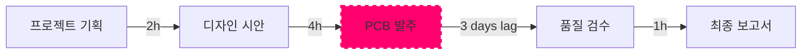
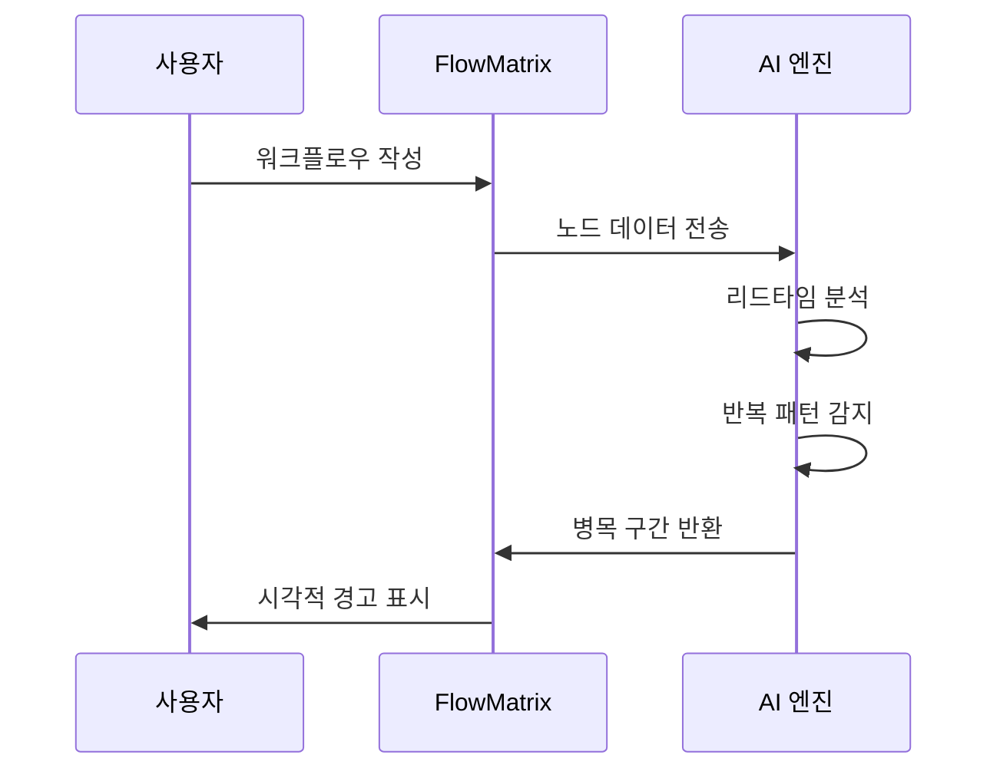
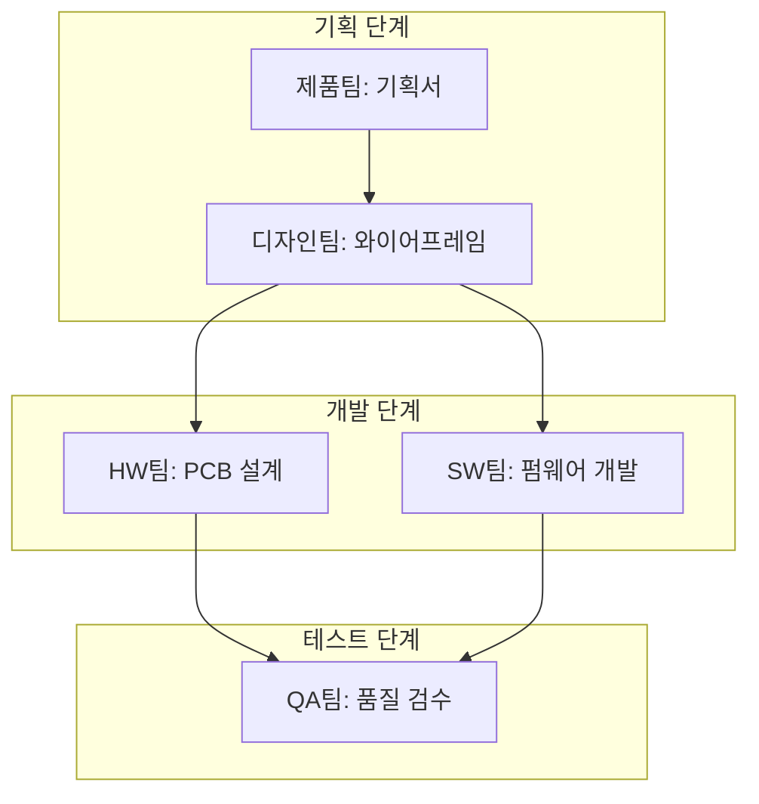
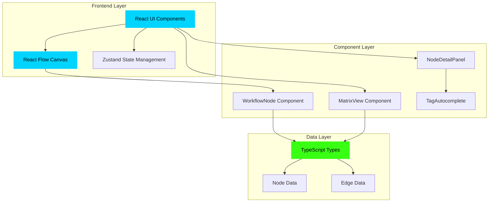
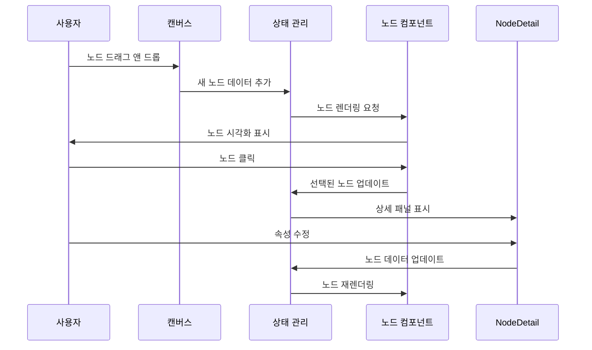
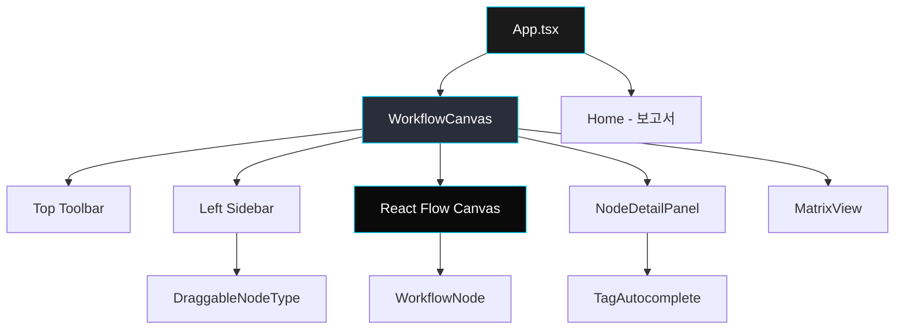

# FlowMatrix - 워크플로우 매핑 플랫폼

**FlowMatrix**는 전사적 업무 프로세스를 시각화하고 최적화하는 지능형 워크플로우 매핑 플랫폼입니다. 복잡한 업무 흐름을 직관적인 노드와 연결선으로 표현하고, AI 기반 병목 분석을 통해 프로세스 개선 기회를 발견할 수 있습니다.

## 📋 목차

1. [주요 기능](#주요-기능)
3. [테스트](#테스트)
2. [시스템 아키텍처](#시스템-아키텍처)
3. [시작하기](#시작하기)
4. [사용 방법](#사용-방법)
5. [프로젝트 구조](#프로젝트-구조)
6. [기술 스택](#기술-스택)
7. [개발 가이드](#개발-가이드)
8. [문제 해결](#문제-해결)

---

## 🎯 주요 기능

### 1. 무한 캔버스 워크플로우 매핑

전사적 프로세스를 제약 없이 매핑할 수 있는 무한 확장 캔버스를 제공합니다. 줌 인/아웃, 팬 이동을 통해 거시적 관점과 미시적 관점을 자유롭게 전환할 수 있습니다.



### 2. 스마트 노드 시스템

4가지 타입의 노드로 업무 프로세스를 구조화합니다:

| 노드 타입 | 설명 | 사용 예시 | 색상 |
|---------|------|----------|------|
| **Trigger** | 프로세스 시작점 | 프로젝트 킥오프, 고객 요청 접수 | 🟢 라임 그린 |
| **Action** | 실행 작업 | 디자인 작성, 코드 개발, 문서 작성 | 🔵 사이버 블루 |
| **Decision** | 판단/검토 | 품질 검수, 승인 프로세스 | 🔴 네온 핑크 |
| **Artifact** | 산출물 | 보고서, 제품, 문서 | 🟣 퍼플 |

### 3. 병목 시각화 및 AI 분석

#### 병목 감지 알고리즘

시스템은 다음 기준으로 병목 구간을 자동 감지합니다:

- **리드타임 분석**: 평균 소요 시간이 전체 프로세스의 30% 이상을 차지하는 작업
- **대기 시간**: 이전 작업 완료 후 3일 이상 지연되는 구간
- **반복 루프**: 재작업이 빈번하게 발생하는 노드

병목으로 감지된 노드는 **붉은색 테두리**와 **펄스 애니메이션**으로 강조 표시됩니다.



#### AI 대체 가능성 스코어링

각 노드는 AI로 자동화 가능한 정도를 0-100점으로 평가받습니다:

- **70점 이상**: 즉시 자동화 가능 (단순 반복 작업)
- **40-69점**: 부분 자동화 가능 (인간 검토 필요)
- **40점 미만**: 창의성/판단력 필요 (자동화 어려움)

평가 기준은 다음과 같습니다:

1. **반복성** (30점): 동일한 작업이 주기적으로 반복되는가?
2. **창의성 필요도** (30점): Brain Usage가 LOW인가?
3. **규칙 기반 가능성** (20점): 명확한 규칙으로 정의 가능한가?
4. **도구 자동화 가능성** (20점): 사용 도구가 API를 제공하는가?

### 4. 매트릭스 뷰

부서(Y축)와 프로젝트 단계(X축)로 구성된 2차원 매트릭스 레이아웃으로 전환할 수 있습니다. 이를 통해 부서별 업무 분포와 단계별 병목을 한눈에 파악할 수 있습니다.



### 5. 드래그 앤 드롭 노드 생성

좌측 패널의 노드 타입 카드를 캔버스로 직접 드래그하여 즉시 노드를 생성할 수 있습니다. 마우스 위치에 정확히 배치되어 빠른 프로세스 매핑이 가능합니다.

### 6. 온톨로지 태그 자동완성

노드에 태그를 입력할 때 기존에 사용된 태그를 지능적으로 추천합니다. 이를 통해 전사적으로 일관된 분류 체계를 유지할 수 있습니다.

**예시:**
- 사용자가 `#디` 입력 → `#디자인`, `#디버깅` 자동 추천
- 새 태그 입력 시 `#` 자동 추가
- Enter 키로 빠른 추가

---

## 🏗️ 시스템 아키텍처

### 전체 시스템 구조



### 데이터 플로우



### 컴포넌트 계층 구조



---

## 🧪 테스트

FlowMatrix는 포괄적인 테스트 전략을 사용합니다:

```bash
# 단위 테스트 (컴포넌트)
pnpm test

# E2E 테스트 (사용자 플로우)
pnpm test:e2e

# 커버리지 리포트
pnpm test:coverage

# Storybook (컴포넌트 카탈로그)
pnpm storybook
```

자세한 내용은 [TESTING.md](./TESTING.md)를 참고하세요.

---

## 🚀 시작하기

### 필수 요구사항

프로젝트를 실행하기 전에 다음 소프트웨어가 설치되어 있어야 합니다:

- **Node.js**: v18.0.0 이상 ([다운로드](https://nodejs.org/))
- **pnpm**: v8.0.0 이상 (npm 대신 사용하는 패키지 매니저)

### 설치 방법

#### 1. 저장소 클론

```bash
git clone <repository-url>
cd flowmatrix-review
```

#### 2. 의존성 설치

```bash
pnpm install
```

이 명령어는 `package.json`에 정의된 모든 라이브러리를 설치합니다. 주요 의존성:
- `react` (19.2.1): UI 라이브러리
- `@xyflow/react` (12.10.0): 캔버스 및 노드 시스템
- `tailwindcss` (4.1.14): CSS 프레임워크
- `lucide-react`: 아이콘 라이브러리

#### 3. 개발 서버 실행

```bash
pnpm dev
```

브라우저에서 `http://localhost:3000`을 열면 애플리케이션이 실행됩니다.

#### 4. 프로덕션 빌드

```bash
pnpm build
pnpm start
```

---

## 📖 사용 방법

### 기본 워크플로우 작성

#### 방법 1: 드래그 앤 드롭

1. 좌측 패널에서 원하는 노드 타입 카드를 선택합니다
2. 마우스로 드래그하여 캔버스의 원하는 위치에 놓습니다
3. 노드가 자동으로 생성됩니다

#### 방법 2: 설정 후 추가

1. 좌측 패널 하단의 드롭다운에서 노드 타입, 부서, 프로젝트 단계를 선택합니다
2. "노드 추가" 버튼을 클릭합니다
3. 캔버스에 랜덤 위치로 노드가 생성됩니다

### 노드 연결하기

1. 노드 하단의 **파란색 핸들**을 클릭합니다
2. 마우스를 드래그하여 연결할 대상 노드의 상단 핸들로 이동합니다
3. 마우스를 놓으면 연결선이 생성됩니다

연결선은 **사이버 블루 색상**으로 표시되며, 데이터 흐름을 나타내는 **애니메이션 효과**가 적용됩니다.

### 노드 편집하기

1. 노드를 클릭하면 우측에 **상세 패널**이 나타납니다
2. 다음 속성을 수정할 수 있습니다:
   - **작업명**: 노드의 제목
   - **소요 시간**: 평균 작업 시간 (예: 30m, 2h, 3d)
   - **창의성 필요도**: LOW, MEDIUM, HIGH
   - **담당자**: 작업 담당자 이름
   - **사용 도구**: 작업에 사용되는 소프트웨어 (예: Figma, Jira)
   - **온톨로지 태그**: 분류 태그 (자동완성 지원)

### 뷰 전환하기

상단 툴바에서 **캔버스** 또는 **매트릭스** 버튼을 클릭하여 뷰를 전환할 수 있습니다:

- **캔버스 뷰**: 자유로운 노드 배치 및 연결선 시각화
- **매트릭스 뷰**: 부서×프로젝트 단계 그리드 레이아웃

### 병목 구간 식별하기

병목으로 표시된 노드는 다음과 같은 특징을 가집니다:

- 🔴 **붉은색 테두리**
- 💓 **펄스 애니메이션** (1.5초 주기로 확대/축소)
- ⚠️ **경고 아이콘**

노드를 클릭하면 상세 패널에서 병목 원인과 개선 방안을 확인할 수 있습니다.

### AI 대체 가능 노드 확인하기

AI로 자동화 가능한 노드는 다음과 같이 표시됩니다:

- ✨ **Sparkles 아이콘** (우상단)
- 🟢 **녹색 배지** (AI 스코어 표시)
- 📊 **진행률 바** (상세 패널)

70점 이상의 노드는 "AI 솔루션 제안 받기" 버튼을 통해 자동화 방안을 확인할 수 있습니다.

---

## 📁 프로젝트 구조

```
flowmatrix-review/
├── client/                      # 프론트엔드 코드
│   ├── public/                  # 정적 파일
│   │   └── images/             # 이미지 에셋
│   ├── src/
│   │   ├── components/         # React 컴포넌트
│   │   │   ├── ui/            # shadcn/ui 기본 컴포넌트
│   │   │   ├── WorkflowNode.tsx       # 워크플로우 노드
│   │   │   ├── MatrixView.tsx         # 매트릭스 뷰
│   │   │   ├── NodeDetailPanel.tsx    # 노드 상세 패널
│   │   │   ├── DraggableNodeType.tsx  # 드래그 가능 노드
│   │   │   ├── TagAutocomplete.tsx    # 태그 자동완성
│   │   │   └── ErrorBoundary.tsx      # 에러 처리
│   │   ├── contexts/          # React Context
│   │   │   └── ThemeContext.tsx       # 다크 테마 관리
│   │   ├── hooks/             # 커스텀 훅
│   │   ├── lib/               # 유틸리티 함수
│   │   │   └── utils.ts              # 공통 유틸
│   │   ├── pages/             # 페이지 컴포넌트
│   │   │   ├── WorkflowCanvas.tsx    # 메인 캔버스 페이지
│   │   │   ├── Home.tsx              # 검토 보고서 페이지
│   │   │   └── NotFound.tsx          # 404 페이지
│   │   ├── types/             # TypeScript 타입 정의
│   │   │   └── workflow.ts           # 워크플로우 타입
│   │   ├── App.tsx            # 앱 루트 컴포넌트
│   │   ├── main.tsx           # 앱 진입점
│   │   └── index.css          # 글로벌 스타일
│   └── index.html             # HTML 템플릿
├── server/                     # 백엔드 (정적 파일 서빙)
│   └── index.ts               # Express 서버
├── shared/                     # 공유 코드
│   └── const.ts               # 공유 상수
├── ideas-mvp.md               # 디자인 아이디어
├── package.json               # 의존성 정의
├── tsconfig.json              # TypeScript 설정
├── tailwind.config.ts         # Tailwind CSS 설정
├── vite.config.ts             # Vite 빌드 설정
└── README.md                  # 프로젝트 문서 (이 파일)
```

### 주요 파일 설명

#### `client/src/types/workflow.ts`

워크플로우 관련 TypeScript 타입을 정의합니다:

```typescript
export type NodeType = "TRIGGER" | "ACTION" | "DECISION" | "ARTIFACT";
export type Department = "HW_TEAM" | "SW_TEAM" | "DESIGN_TEAM" | ...;
export interface ActivityNode { ... }
export interface WorkflowRelationship { ... }
```

#### `client/src/components/WorkflowNode.tsx`

개별 워크플로우 노드를 렌더링하는 컴포넌트입니다. 노드 타입에 따라 색상과 아이콘이 달라지며, 병목/AI 스코어를 시각적으로 표시합니다.

#### `client/src/pages/WorkflowCanvas.tsx`

메인 캔버스 페이지로, React Flow를 사용하여 무한 캔버스를 구현합니다. 노드 생성, 연결, 드래그 앤 드롭 등 모든 인터랙션을 관리합니다.

#### `client/src/index.css`

Neo-Brutalism 디자인 시스템을 정의합니다:
- OKLCH 색상 시스템
- 커스텀 애니메이션 (pulse-bottleneck)
- 그리드 배경 스타일
- React Flow 커스터마이징

---

## 🛠️ 기술 스택

### 프론트엔드

| 기술 | 버전 | 용도 |
|-----|------|------|
| **React** | 19.2.1 | UI 라이브러리 |
| **TypeScript** | 5.6.3 | 타입 안정성 |
| **Vite** | 7.1.9 | 빌드 도구 |
| **Tailwind CSS** | 4.1.14 | 스타일링 |
| **React Flow** | 12.10.0 | 캔버스 및 노드 시스템 |
| **Wouter** | 3.7.1 | 라우팅 |
| **Framer Motion** | 12.23.22 | 애니메이션 |
| **shadcn/ui** | - | UI 컴포넌트 라이브러리 |
| **Lucide React** | 0.453.0 | 아이콘 |

### 개발 도구

- **pnpm**: 빠른 패키지 매니저
- **ESLint**: 코드 품질 검사
- **Prettier**: 코드 포맷팅
- **TypeScript**: 정적 타입 검사

### 디자인 시스템

**Neo-Brutalism meets Data Visualization Dashboard**

- **색상 체계**: OKLCH 색상 공간 사용
  - Primary: `oklch(0.65 0.25 230)` - 사이버 블루
  - Accent: `oklch(0.60 0.30 350)` - 네온 핑크
  - Success: `oklch(0.75 0.25 130)` - 라임 그린
  - Background: `oklch(0.08 0.01 260)` - 다크 배경

- **타이포그래피**:
  - Display: Space Grotesk (700)
  - Body: Inter (400, 500)
  - Mono: JetBrains Mono (400)

- **애니메이션**:
  - Smooth Transitions: 300ms ease-out
  - Pulse Effect: 1.5초 주기 scale(1.05)
  - Connection Flow: 점선 애니메이션

---

## 💻 개발 가이드

### 새 노드 타입 추가하기

1. `client/src/types/workflow.ts`에 새 타입 추가:

```typescript
export type NodeType = "TRIGGER" | "ACTION" | "DECISION" | "ARTIFACT" | "NEW_TYPE";
```

2. `client/src/components/WorkflowNode.tsx`에 아이콘 및 색상 정의:

```typescript
const nodeTypeIcons = {
  // ...
  NEW_TYPE: YourIcon,
};

const nodeTypeColors = {
  // ...
  NEW_TYPE: "text-your-color border-your-color",
};
```

3. `client/src/pages/WorkflowCanvas.tsx`의 좌측 패널에 드래그 가능 노드 추가:

```tsx
<DraggableNodeType
  type="NEW_TYPE"
  label="New Type (설명)"
  icon={YourIcon}
  colorClass="border-your-color text-your-color"
/>
```

### 커스텀 색상 추가하기

`client/src/index.css`의 `:root` 섹션에 새 색상 변수 추가:

```css
:root {
  --your-color: oklch(0.70 0.20 180);
}
```

Tailwind에서 사용:

```tsx
<div className="bg-[oklch(0.70_0.20_180)]">...</div>
```

### 새 컴포넌트 생성하기

1. `client/src/components/` 디렉토리에 파일 생성
2. 컴포넌트 상단에 디자인 철학 주석 추가:

```tsx
/* Design: Neo-Brutalist card with strong borders
 * Features: Hover effects, responsive layout
 */
```

3. shadcn/ui 컴포넌트 재사용:

```tsx
import { Card, CardContent } from "@/components/ui/card";
```

---

## 🐛 문제 해결

### 개발 서버가 시작되지 않을 때

**증상**: `pnpm dev` 실행 시 에러 발생

**해결 방법**:

1. Node.js 버전 확인:
```bash
node --version  # v18.0.0 이상이어야 함
```

2. 의존성 재설치:
```bash
rm -rf node_modules
pnpm install
```

3. 포트 충돌 확인:
```bash
lsof -i :3000  # 3000 포트 사용 중인 프로세스 확인
kill -9 <PID>  # 해당 프로세스 종료
```

### 노드가 드래그되지 않을 때

**증상**: 좌측 패널의 노드를 드래그해도 캔버스에 추가되지 않음

**원인**: React Flow 인스턴스가 초기화되지 않음

**해결 방법**:

1. 브라우저 콘솔에서 에러 확인
2. `WorkflowCanvas.tsx`의 `onInit` 핸들러 확인:

```tsx
<ReactFlow
  onInit={setReactFlowInstance}  // 이 줄이 있는지 확인
  ...
/>
```

### 태그 자동완성이 작동하지 않을 때

**증상**: 태그 입력 시 추천이 나타나지 않음

**해결 방법**:

1. 기존 노드에 태그가 있는지 확인 (최소 1개 이상 필요)
2. `allTags` prop이 제대로 전달되는지 확인:

```tsx
<NodeDetailPanel
  allTags={allTags}  // 이 prop이 있는지 확인
  ...
/>
```

### 빌드 에러 발생 시

**증상**: `pnpm build` 실행 시 TypeScript 에러

**해결 방법**:

1. 타입 검사 실행:
```bash
pnpm check
```

2. 에러 메시지를 확인하고 해당 파일 수정
3. 일반적인 에러:
   - `Property does not exist`: 타입 정의 누락
   - `Type is not assignable`: 타입 불일치

---

## 📝 라이선스

MIT License

---

## 👥 기여하기

이슈 및 풀 리퀘스트를 환영합니다!

1. Fork the Project
2. Create your Feature Branch (`git checkout -b feature/AmazingFeature`)
3. Commit your Changes (`git commit -m 'Add some AmazingFeature'`)
4. Push to the Branch (`git push origin feature/AmazingFeature`)
5. Open a Pull Request

---

## 📞 문의

프로젝트 관련 문의사항은 이슈를 등록해주세요.

---

**Built with ❤️ by Manus AI**
