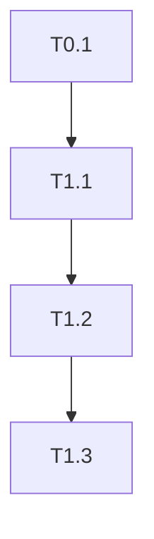

# FlowMatrix Development Skills

This document describes the AI-assisted development automation skills available in the FlowMatrix project. These skills are **development tools** for building and planning the FlowMatrix application, not part of the application itself.

## Overview

FlowMatrix uses **4 specialized AI skills** to automate and enhance the development workflow:

| Skill | Trigger | Purpose | Output |
|-------|---------|---------|--------|
| **project-bootstrap** | "에이전트 팀 만들어줘" | Multi-agent team generation | Agent files, MCP config, Docker Compose |
| **socrates** | "기획해줘" | Project planning via Socratic questions | 6 planning documents (PRD, TRD, etc.) |
| **tasks-generator** | Auto-called by socrates | TDD task breakdown | TASKS.md with phased milestones |
| **deep-research** | "리서치해줘" | Multi-API parallel research | Aggregated search results from 5 APIs |

---

## Skill Orchestration Workflow

```mermaid
graph TD
    A[User: "에이전트 팀 만들어줘"] --> B{Tech Stack Provided?}
    B -->|No| C[Trigger: socrates]
    B -->|Yes| D[project-bootstrap: Stage 2]

    C --> E[socrates: 21 Questions]
    E --> F[Generate 6 Documents]
    F --> G[Trigger: tasks-generator]

    G --> H[tasks-generator: Create TASKS.md]
    H --> I[Return to project-bootstrap]

    I --> D
    D --> J[Stage 3: Confirm Setup]
    J --> K[Stage 4: Generate Project]
    K --> L[Create Agents, MCP, Docker]
    L --> M[Stage 5: Install Dependencies]
    M --> N[Stage 6: Confirm Planning]
    N -->|User Wants Planning| C
    N -->|Skip| O[Ready for Development]

    style C fill:#ff006e,stroke:#ff006e,color:#fff
    style G fill:#39ff14,stroke:#39ff14,color:#000
    style K fill:#00d4ff,stroke:#00d4ff,color:#000
```

---

## 1. project-bootstrap

**Purpose**: Automatically generates multi-agent development teams and sets up full-stack project environments.

**Trigger Keywords**: Must contain "에이전트 팀" (e.g., "에이전트 팀 만들어줘", "에이전트 팀 구성")

### Supported Tech Stacks

**Backend Frameworks**:
- **FastAPI** (Python) - SQLAlchemy + Alembic + JWT auth
- **Express** (TypeScript) - Prisma + JWT auth
- **Rails** (Ruby) - ActiveRecord + Session/JWT + SQLite WAL
- **Django** (Python) - Django ORM + DRF

**Frontend Frameworks**:
- **React + Vite** - Zustand state management + TanStack Query
- **Next.js** - App Router + Zustand
- **SvelteKit** - Svelte 5 runes
- **Remix** - Loader/Action pattern

**Databases**:
- PostgreSQL
- PostgreSQL + PGVector (vector database)
- PostgreSQL + Redis (caching)
- MySQL
- MongoDB
- SQLite

**Additional Features**:
- Authentication UI (Login, Register, Profile pages)
- 3D Engine (Three.js, Babylon.js specialist)
- Vector search (PGVector)
- Redis caching

### Workflow (6 Stages)

#### Stage 1: Tech Stack Verification
- Asks user for backend and frontend choices
- If not provided, **triggers socrates skill** for detailed planning

#### Stage 2: Sub-Tech Selection
Confirms:
- Database type
- Authentication requirements
- Additional features (vector DB, caching, 3D engine)

#### Stage 3: Project Setup Confirmation
- Shows planned project structure
- Confirms agent team composition
- User approval required

#### Stage 4: Full Project Generation
Generates:
1. **Agent Files** (6-7 Claude agent .md files):
   - Backend Specialist (FastAPI/Express/Rails/Django expert)
   - Frontend Specialist (React/Next/Svelte/Remix expert)
   - Database Specialist (migrations, schema design)
   - Test Specialist (unit, integration, E2E tests)
   - 3D Engine Specialist (if selected)
   - Orchestrator commands

2. **MCP Server Configuration**:
   - Database connection MCP
   - File system MCP
   - Git operations MCP

3. **Docker Compose**:
   - Database container
   - Redis container (if selected)
   - Application containers

4. **Project Structure**:
   - Backend with authentication API
   - Frontend with auth UI pages
   - API contract definitions (TypeScript interfaces)
   - Test scaffolding

#### Stage 5: Dependency Installation
- Runs `npm install` / `pip install` / `bundle install`
- Initializes database migrations

#### Stage 6: Planning Document Confirmation
- Offers to generate planning docs via socrates
- If accepted, triggers socrates skill

### TDD & Git Worktree Strategy

**Phase 0**: Direct commits to `main`
- Initial setup and configuration
- No tests required yet

**Phase 1+**: Git Worktree branches
- Automatically creates isolated worktree branches
- Enforces **Red → Green → Refactor** TDD cycle
- Backend and frontend can work in parallel worktrees

### File Structure

```
skills/project-bootstrap/
├── SKILL.md                    # Main skill definition
├── README.md                   # Comprehensive guide
├── references/                 # Agent & command templates
│   ├── orchestrate-command.md          # Coordination command
│   ├── backend-specialist.md           # Backend expert
│   ├── frontend-specialist.md          # Frontend expert
│   ├── database-specialist.md          # DB expert
│   ├── test-specialist.md              # QA expert
│   ├── 3d-engine-specialist.md         # 3D specialist
│   ├── integration-validator.md        # Integration testing
│   ├── agent-lifecycle.md              # Lifecycle management
│   └── orchestrator.md                 # (Deprecated)
├── templates/                  # Project code templates
│   ├── backend/
│   │   ├── fastapi/
│   │   ├── express/
│   │   └── rails/
│   ├── frontend/
│   │   ├── react-vite/
│   │   ├── nextjs/
│   │   ├── sveltekit/
│   │   └── remix/
│   ├── contracts/              # API contract definitions
│   │   ├── auth.contract.ts
│   │   ├── feature.contract.template.ts
│   │   ├── types.ts
│   │   └── README.md
│   └── .claude/                # Claude settings template
├── scripts/                    # Python automation scripts
│   ├── setup_backend.py        # Backend framework initialization
│   ├── setup_frontend.py       # Frontend framework initialization
│   ├── setup_docker.py         # Docker Compose generation
│   ├── setup_mcp.py            # MCP server configuration
│   ├── git_init.py             # Git repository initialization
│   ├── skill_evaluator.py      # Skill matching evaluation
│   ├── defense_in_depth.py     # Security defense layer
│   └── three_tier_defense.py   # Multi-level security
└── hooks/                      # Automation hooks
    ├── README.md
    ├── session_init.py         # SessionStart event
    ├── defense_in_depth_hook.sh        # PreToolUse event
    └── skill_evaluator_hook.sh         # UserPromptSubmit event
```

### Authentication Templates

All backend/frontend combinations include:
- **Login page**: Email + password
- **Register page**: Account creation
- **Profile page**: Password change, logout, account deletion
- **JWT token handling**: Secure token storage and refresh
- **Protected routes**: Authentication middleware

---

## 2. socrates

**Purpose**: Transforms vague project ideas into structured planning documents through 21 Socratic questions.

**Trigger Keywords**: "기획해줘", "프로젝트 기획", or auto-called by project-bootstrap

### Workflow

#### Phase 1: Consultation (21 Questions)
Non-technical questions to understand:
1. Problem definition
2. Target audience/persona
3. MVP scope definition
4. Success metrics
5. Technology preferences
6. Timeline expectations
7. Team composition
8. Budget constraints
9. Competitive landscape
10. Risk factors
11. ... (11 more questions)

**Important**: Socrates **never writes documents directly** without completing all 21 questions first.

#### Phase 2: Document Generation
Creates 6 structured markdown files in `docs/planning/`:

1. **01-prd.md** (Product Requirements Document):
   - Features
   - User stories
   - Acceptance criteria
   - Non-functional requirements

2. **02-trd.md** (Technical Requirements Document):
   - Architecture decisions
   - Tech stack justification
   - Infrastructure requirements
   - Security considerations

3. **03-user-flow.md** (User Flows & Wireframes):
   - User journey maps
   - Flow diagrams (Mermaid)
   - Screen wireframes (ASCII art or Markdown tables)

4. **04-database-design.md** (Database Schema):
   - Entity-Relationship diagrams
   - Table definitions
   - Indexes and constraints
   - Migration strategy

5. **05-design-system.md** (Design System):
   - Design tokens (colors, typography, spacing)
   - Component catalog
   - Accessibility guidelines
   - Responsive breakpoints

6. **07-coding-convention.md** (Coding Standards):
   - Naming conventions
   - File structure rules
   - Code review checklist
   - Git commit message format

#### Phase 3: Auto-Trigger tasks-generator
After generating 6 documents, automatically calls **tasks-generator** to create TASKS.md.

### File Structure

```
skills/socrates/
├── SKILL.md                            # Skill definition
└── references/
    ├── questions.md                    # Q1-Q21 questions
    ├── conversation-rules.md           # Dialog rules & heuristics
    ├── prd-template.md                 # Product Requirements template
    ├── trd-template.md                 # Technical Requirements template
    ├── user-flow-template.md           # User flow diagrams template
    ├── database-design-template.md     # Database schema template
    ├── design-system-template.md       # UI/UX design system template
    ├── coding-convention-template.md   # Code style guidelines template
    ├── tasks-generation-rules.md       # Rules for task creation
    └── tasks-template.md               # TASKS.md template (47KB)
```

---

## 3. tasks-generator

**Purpose**: Converts planning documents into TDD-compliant task lists with proper phase numbering and Git Worktree strategy.

**Trigger**: Auto-called by socrates, or manual invocation with "TASKS.md 만들어줘"

### Workflow

#### Step 1: Read Planning Documents
Analyzes:
- **PRD**: Extracts features and user stories
- **TRD**: Confirms technology choices
- **User Flow**: Structures milestones
- **Database Design**: Identifies database tasks
- **Design System**: References UI components

#### Step 2: Apply TDD Rules
- **Phase 0**: Direct main branch work (setup tasks)
- **Phase 1+**: Git Worktree + TDD cycle
  - **RED**: Write failing tests first
  - **GREEN**: Implement minimal code to pass
  - **REFACTOR**: Clean up code

#### Step 3: Generate TASKS.md
Output structure:
```markdown
# TASKS.md

## MVP Capsule (10-Point Summary)
[10 핵심 요약 포인트]

## Milestone Overview
- M0: 프로젝트 초기 설정
- M1: 백엔드 기본 구조
- M2: 프론트엔드 기본 구조
- M3: 핵심 기능 구현
- ...

## Phase 0 (Main Branch)
### T0.1: 프로젝트 초기화
- [ ] Git 저장소 초기화
- [ ] 의존성 설치
- [ ] 환경 변수 설정

## Phase 1 (Worktree: backend-auth)
### T1.1: 인증 API 테스트 작성 (RED)
- [ ] 회원가입 API 테스트
- [ ] 로그인 API 테스트

### T1.2: 인증 API 구현 (GREEN)
- [ ] 회원가입 엔드포인트
- [ ] 로그인 엔드포인트

### T1.3: 리팩토링 (REFACTOR)
- [ ] 중복 코드 제거
- [ ] 에러 처리 개선

## Dependency Graph

```

### File Structure

```
skills/tasks-generator/
├── SKILL.md              # Skill definition
└── references/
    └── tasks-rules.md    # Core rules for task generation
```

---

## 4. deep-research

**Purpose**: Performs comprehensive research by parallel-executing 5 search APIs.

**Trigger Keywords**: "리서치해줘", "조사해줘", "찾아봐", "검색해줘", "deep dive"

### Search APIs (5 Parallel Calls)

1. **Brave Search**:
   - General web search
   - Returns 20 results with descriptions

2. **Tavily Search**:
   - AI-enhanced web search
   - Returns 20 results + instant answer summary

3. **Perplexity Search**:
   - Reasoning-based search with citations
   - Uses `sonar-reasoning-pro` model
   - Returns structured answer with sources

4. **Naver Search**:
   - Korean-language specialized search
   - Returns 10 results from Korean web

5. **YouTube Search**:
   - Video content search
   - Returns 10 video results with metadata

### Workflow

1. **Load Environment Variables**:
   ```bash
   BRAVE_API_KEY=...
   TAVILY_API_KEY=...
   PERPLEXITY_API_KEY=...
   NAVER_CLIENT_ID=...
   NAVER_CLIENT_SECRET=...
   YOUTUBE_API_KEY=...
   ```

2. **Execute Parallel Searches**:
   - All 5 APIs called simultaneously
   - Timeout: 30 seconds per API

3. **Merge Results**:
   - Python script `merge_results.py` aggregates outputs
   - Deduplicates URLs
   - Ranks by relevance

4. **Report Findings**:
   - Key findings (3-5 summary points)
   - Sources by API type
   - Reference links
   - Video resources (if relevant)

### Environment Setup

Create `.env` file:
```bash
# Required for deep-research skill
BRAVE_API_KEY=your_brave_api_key
TAVILY_API_KEY=your_tavily_api_key
PERPLEXITY_API_KEY=your_perplexity_api_key
NAVER_CLIENT_ID=your_naver_client_id
NAVER_CLIENT_SECRET=your_naver_client_secret
YOUTUBE_API_KEY=your_youtube_api_key
```

### File Structure

```
skills/deep-research/
├── skill.md              # Skill definition
└── scripts/
    └── merge_results.py  # Result aggregation script (10,676 bytes)
```

---

## Hook System

FlowMatrix project-bootstrap includes **3 automatic hooks** for enhanced workflow:

### 1. SessionStart Hook (`session_init.py`)
**Trigger**: When a new Claude Code session starts

**Actions**:
- Loads project context
- Detects `CLAUDE.md` presence
- Verifies agent team existence
- Displays tech stack summary

**Example Output**:
```
🚀 FlowMatrix MVP Detected
📚 Tech Stack: FastAPI + React + PostgreSQL
👥 Agents: backend-specialist, frontend-specialist, database-specialist, test-specialist
📄 Planning: docs/planning/ (6 documents)
```

### 2. UserPromptSubmit Hook (`skill_evaluator_hook.sh`)
**Trigger**: Before processing user prompt

**Actions**:
- Analyzes user prompt for skill keywords
- Matches relevant skills
- Shows recommendations if match found

**Example Output**:
```
💡 Skill Recommendation:
Your prompt matches the 'socrates' skill.
Would you like to start project planning? (Type "기획해줘")
```

### 3. PreToolUse Hook (`defense_in_depth_hook.sh`)
**Trigger**: Before executing Bash tool

**Actions**:
- Detects dangerous commands (`rm -rf`, `git reset --hard`, etc.)
- Auto-creates backup commit
- Requires confirmation for critical operations

**Example Output**:
```
⚠️  Dangerous Command Detected: rm -rf node_modules
🛡️  Backup commit created: backup-20260111-143022
✅ Proceed? [y/N]
```

---

## Usage Examples

### Example 1: Full Project Setup with Planning

```bash
User: "FastAPI + React로 에이전트 팀 만들어줘, 기획도 같이 해줘"

Claude:
1. project-bootstrap triggered
2. Stage 1: Confirms FastAPI + React
3. Stage 2: Asks about database (selects PostgreSQL)
4. Stage 3: Shows project plan
5. Stage 4: Generates agents, MCP, Docker
6. Stage 5: Installs dependencies
7. Stage 6: Triggers socrates skill
8. socrates: 21 questions
9. socrates: Generates 6 documents
10. tasks-generator: Creates TASKS.md
11. ✅ Ready for development with full planning
```

### Example 2: Research Before Implementation

```bash
User: "WebSocket vs SSE 리서치해줘"

Claude:
1. deep-research triggered
2. Brave: 20 web results
3. Tavily: 20 results + AI summary
4. Perplexity: Reasoning-based answer with citations
5. Naver: 10 Korean articles
6. YouTube: 10 tutorial videos
7. Aggregated report with pros/cons comparison
```

### Example 3: Planning Only (No Project Generation)

```bash
User: "채팅 앱 기획해줘"

Claude:
1. socrates triggered
2. 21 questions about chat app requirements
3. Generates 6 planning documents
4. tasks-generator creates TASKS.md
5. ✅ Planning complete (no code generated yet)
```

---

## Best Practices

### When to Use Each Skill

| Situation | Recommended Skill | Reason |
|-----------|------------------|--------|
| Starting new project from scratch | **project-bootstrap** | Sets up entire environment |
| Have vague idea, need structure | **socrates** | Clarifies requirements |
| Planning docs done, need tasks | **tasks-generator** | Breaks down work |
| Need technology comparison | **deep-research** | Gathers multi-source data |

### Skill Combination Patterns

**Pattern 1: Complete Greenfield Project**
```
socrates → tasks-generator → project-bootstrap → Development
```

**Pattern 2: Quick MVP with Known Stack**
```
project-bootstrap (with tech stack) → Development
```

**Pattern 3: Research-Driven Development**
```
deep-research → socrates → tasks-generator → project-bootstrap
```

---

## Relationship to FlowMatrix Application

**Important**: These skills are **development automation tools**, not features of the FlowMatrix application itself.

- **FlowMatrix App**: Workflow mapping platform (React, TypeScript, React Flow)
- **Skills**: Tools for building FlowMatrix or any other project

**Use Skills For**:
- Setting up FlowMatrix development environment
- Planning new FlowMatrix features
- Researching workflow analysis algorithms
- Breaking down FlowMatrix roadmap into tasks

**Do NOT Confuse**:
- Skills are not part of the FlowMatrix user-facing application
- Skills won't be deployed with FlowMatrix
- Skills documentation is separate from FlowMatrix app documentation

---

## Maintenance & Updates

### File Locations

- **Skills Directory**: `/Users/jueunlee/dev/flowmatrix-mvp/skills/`
- **This Documentation**: `/Users/jueunlee/dev/flowmatrix-mvp/SKILLS.md`
- **Individual READMEs**: Each skill has its own `README.md`

### Version History

- **2026-01-11**: Initial SKILLS.md creation
- Skills themselves have been stable since project inception

### Contributing to Skills

Skills are maintained separately from FlowMatrix app code. To modify skills:

1. Edit skill definitions in `skills/{skill-name}/SKILL.md`
2. Update templates in `skills/{skill-name}/templates/`
3. Test with sample prompts
4. Update this SKILLS.md if workflow changes

---

## Troubleshooting

### Skill Not Triggering

**Problem**: Saying "에이전트 팀 만들어줘" doesn't trigger project-bootstrap

**Solution**:
- Ensure exact Korean keywords are used
- Check skill definition in `skills/project-bootstrap/SKILL.md`
- Verify hooks are enabled in Claude settings

### Environment Variables Not Found

**Problem**: deep-research fails with "API key not found"

**Solution**:
- Create `.env` file in project root
- Add all 6 required API keys
- Restart Claude Code session

### Planning Documents Not Generated

**Problem**: socrates skill completes 21 questions but doesn't write docs

**Solution**:
- Check `docs/planning/` directory exists
- Ensure write permissions
- Verify all 21 questions were answered

---

## Further Reading

- **project-bootstrap README**: `skills/project-bootstrap/README.md` (554 lines, comprehensive guide)
- **socrates SKILL.md**: `skills/socrates/SKILL.md` (198 lines, question catalog)
- **tasks-generator SKILL.md**: `skills/tasks-generator/SKILL.md` (174 lines, TDD rules)
- **deep-research skill.md**: `skills/deep-research/skill.md` (161 lines, API specs)

---

**Maintained by**: FlowMatrix Development Team
**Last Updated**: 2026-01-11
