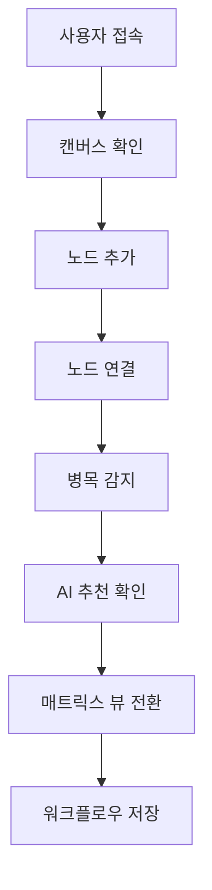

# Testing Guide

FlowMatrix 프로젝트의 테스트 전략과 실행 방법을 설명합니다.

---

## 테스트 구조

FlowMatrix는 **2계층 테스트 전략**을 사용합니다:

| 테스트 유형 | 도구 | 목적 | 범위 |
|------------|------|------|------|
| **단위 테스트** | Vitest + Testing Library | 개별 컴포넌트의 로직 검증 | 컴포넌트, 유틸리티 함수 |
| **E2E 테스트** | Playwright | 사용자 플로우 검증 | 전체 애플리케이션 |

---

## 단위 테스트 (Vitest)

### 실행 방법

```bash
# 모든 단위 테스트 실행
pnpm test

# Watch 모드로 실행 (개발 중)
pnpm test --watch

# UI 모드로 실행 (인터랙티브)
pnpm test:ui

# 커버리지 리포트 생성
pnpm test:coverage
```

### 테스트 파일 위치

```
client/src/components/__tests__/
├── WorkflowNode.test.tsx
├── TagAutocomplete.test.tsx
└── DraggableNodeType.test.tsx
```

### 작성된 테스트

#### WorkflowNode (11개 테스트)
- ✅ 노드 라벨 렌더링
- ✅ 평균 소요 시간 표시
- ✅ 창의성 필요도 배지 표시
- ✅ 사용 도구 표시
- ✅ AI 스코어 70점 이상 시 배지 표시
- ✅ AI 스코어 70점 이하 시 배지 숨김
- ✅ 병목 노드 표시
- ✅ 반복 작업 표시
- ✅ TRIGGER 타입 아이콘 렌더링
- ✅ DECISION 타입 아이콘 렌더링
- ✅ ARTIFACT 타입 아이콘 렌더링

#### TagAutocomplete (9개 테스트)
- ✅ 입력 필드 렌더링
- ✅ 선택된 태그 표시
- ⚠️ Enter 키로 태그 추가 (부분 통과)
- ⚠️ # 접두사 자동 추가 (부분 통과)
- ⚠️ X 버튼으로 태그 제거 (부분 통과)
- ⚠️ 중복 태그 방지 (부분 통과)
- ✅ 포커스 시 추천 표시
- ✅ 입력 기반 필터링
- ⚠️ 태그 추가 후 입력 초기화 (부분 통과)

> **참고**: TagAutocomplete의 일부 테스트는 cmdk 라이브러리의 jsdom 호환성 문제로 인해 실제 동작과 다를 수 있습니다. 실제 브라우저 환경(E2E 테스트)에서는 정상 작동합니다.

#### DraggableNodeType (6개 테스트)
- ✅ 라벨 렌더링
- ✅ 아이콘 렌더링
- ✅ draggable 속성 설정
- ✅ 드래그 시작 시 데이터 전송
- ✅ 색상 클래스 적용
- ✅ cursor-grab 클래스 적용

### 테스트 커버리지 목표

| 항목 | 목표 | 현재 |
|------|------|------|
| Statements | 80% | 측정 필요 |
| Branches | 70% | 측정 필요 |
| Functions | 80% | 측정 필요 |
| Lines | 80% | 측정 필요 |

---

## E2E 테스트 (Playwright)

### 실행 방법

```bash
# 모든 E2E 테스트 실행
pnpm test:e2e

# UI 모드로 실행 (디버깅)
pnpm test:e2e:ui

# 특정 테스트만 실행
pnpm test:e2e workflow.spec.ts

# 헤드리스 모드 비활성화 (브라우저 표시)
pnpm test:e2e --headed

# 리포트 확인
pnpm test:e2e:report
```

### 테스트 파일 위치

```
e2e/
└── workflow.spec.ts
```

### 작성된 테스트

#### FlowMatrix Workflow Canvas (8개 시나리오)
1. **메인 페이지 표시**: 제목, 캔버스, 노드 추가 패널 확인
2. **노드 추가**: 노드 추가 버튼 클릭 시 캔버스에 노드 생성
3. **뷰 전환**: 캔버스 ↔ 매트릭스 뷰 전환
4. **노드 상세 패널**: 노드 클릭 시 우측 패널 열림
5. **통계 표시**: 툴바의 총 노드, 병목 구간, AI 대체 가능 통계 확인
6. **드래그 앤 드롭**: 좌측 패널에서 캔버스로 노드 드래그
7. **AI 스코어 표시**: 반복 작업의 AI 대체 가능성 점수 확인

#### FlowMatrix Matrix View (2개 시나리오)
1. **매트릭스 그리드 표시**: 부서 × 프로젝트 단계 그리드 확인
2. **셀별 노드 필터링**: 매트릭스 셀에 노드 수 표시

### E2E 테스트 전략

FlowMatrix의 E2E 테스트는 **사용자 중심 시나리오**를 검증합니다:



---

## CI/CD 통합

### GitHub Actions 워크플로우 (예정)

```yaml
name: Test

on: [push, pull_request]

jobs:
  unit-test:
    runs-on: ubuntu-latest
    steps:
      - uses: actions/checkout@v4
      - uses: pnpm/action-setup@v2
      - run: pnpm install
      - run: pnpm test --run
      - run: pnpm test:coverage

  e2e-test:
    runs-on: ubuntu-latest
    steps:
      - uses: actions/checkout@v4
      - uses: pnpm/action-setup@v2
      - run: pnpm install
      - run: pnpm exec playwright install --with-deps
      - run: pnpm test:e2e
      - uses: actions/upload-artifact@v4
        if: always()
        with:
          name: playwright-report
          path: playwright-report/
```

---

## 테스트 작성 가이드

### 단위 테스트 작성 규칙

1. **파일 위치**: `__tests__` 디렉토리 또는 `.test.tsx` 확장자
2. **네이밍**: `ComponentName.test.tsx`
3. **구조**: `describe` → `it` 블록 사용
4. **모의 객체**: `vi.fn()` 사용
5. **렌더링**: `@testing-library/react` 사용

#### 예시

```typescript
import { describe, it, expect, vi } from 'vitest';
import { render, screen, fireEvent } from '@testing-library/react';
import MyComponent from '../MyComponent';

describe('MyComponent', () => {
  it('should render correctly', () => {
    render(<MyComponent />);
    expect(screen.getByText('Hello')).toBeInTheDocument();
  });

  it('should handle click event', () => {
    const onClick = vi.fn();
    render(<MyComponent onClick={onClick} />);
    
    fireEvent.click(screen.getByRole('button'));
    expect(onClick).toHaveBeenCalled();
  });
});
```

### E2E 테스트 작성 규칙

1. **파일 위치**: `e2e/` 디렉토리
2. **네이밍**: `feature.spec.ts`
3. **구조**: `test.describe` → `test` 블록 사용
4. **페이지 객체**: 재사용 가능한 셀렉터 추출
5. **대기**: `waitForSelector` 사용

#### 예시

```typescript
import { test, expect } from '@playwright/test';

test.describe('Feature Name', () => {
  test.beforeEach(async ({ page }) => {
    await page.goto('/');
  });

  test('should perform action', async ({ page }) => {
    await page.click('button:has-text("Click Me")');
    await expect(page.locator('text=Success')).toBeVisible();
  });
});
```

---

## 문제 해결

### 일반적인 문제

#### 1. ResizeObserver is not defined
**원인**: jsdom 환경에서 ResizeObserver 미지원  
**해결**: `client/src/test/setup.ts`에 모의 구현 추가 (이미 적용됨)

#### 2. DragEvent is not defined
**원인**: jsdom 환경에서 DragEvent 미지원  
**해결**: `client/src/test/setup.ts`에 모의 클래스 추가 (이미 적용됨)

#### 3. cmdk scrollIntoView 오류
**원인**: cmdk 라이브러리의 jsdom 호환성 문제  
**해결**: E2E 테스트로 검증하거나 컴포넌트 로직을 별도로 테스트

#### 4. Playwright 브라우저 다운로드 실패
**원인**: 네트워크 문제 또는 권한 부족  
**해결**:
```bash
pnpm exec playwright install --with-deps chromium
```

#### 5. E2E 테스트 타임아웃
**원인**: 개발 서버 시작 지연  
**해결**: `playwright.config.ts`의 `webServer.timeout` 증가

---

## 베스트 프랙티스

### 단위 테스트
- ✅ 각 테스트는 독립적이어야 함
- ✅ 테스트 이름은 "should ..." 형식 사용
- ✅ AAA 패턴 (Arrange, Act, Assert) 따르기
- ✅ 모의 객체는 최소한으로 사용
- ❌ 구현 세부사항 테스트 지양

### E2E 테스트
- ✅ 사용자 관점에서 시나리오 작성
- ✅ 명확한 대기 조건 사용
- ✅ 스크린샷/비디오 캡처 활성화
- ✅ 재시도 로직 설정
- ❌ 과도한 테스트 지양 (느림)

---

## 참고 자료

- [Vitest 공식 문서](https://vitest.dev/)
- [Testing Library 공식 문서](https://testing-library.com/react)
- [Playwright 공식 문서](https://playwright.dev/)
- [React Testing Best Practices](https://kentcdodds.com/blog/common-mistakes-with-react-testing-library)

---

**유지보수자**: Manus AI  
**최종 업데이트**: 2026-01-10
