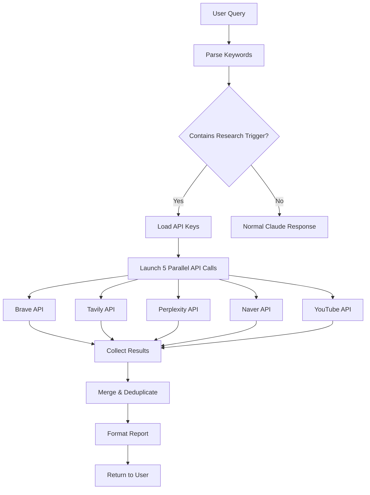

# Deep Research: Multi-API Parallel Search

Performs comprehensive research by executing 5 search APIs in parallel and aggregating results.

## What is Deep Research?

Deep Research is a meta-search skill that queries **5 different search APIs** simultaneously:
1. **Brave Search** - General web search (20 results)
2. **Tavily Search** - AI-enhanced search with instant answers (20 results + summary)
3. **Perplexity AI** - Reasoning-based search with citations
4. **Naver Search** - Korean-language specialized search (10 results)
5. **YouTube** - Video content search (10 videos)

Instead of searching each platform manually, Deep Research does it all at once and presents a consolidated report.

## When to Use Deep Research

**Use Deep Research when**:
- ✅ Comparing technologies (e.g., "React vs Vue vs Svelte")
- ✅ Researching best practices (e.g., "JWT vs Session authentication")
- ✅ Finding tutorials/videos on a topic
- ✅ Getting Korean + English perspectives
- ✅ Need citations for technical decisions

**Skip Deep Research when**:
- ❌ You need a simple definition (use regular Claude)
- ❌ You want to search a specific website
- ❌ API keys are not configured

## How to Use

### 1. Setup API Keys (One-Time)

Create a `.env` file or add to `~/.zshenv` / `~/.zshrc`:

```bash
# Required for deep-research skill
export BRAVE_API_KEY="your_brave_api_key"
export TAVILY_API_KEY="your_tavily_api_key"
export PERPLEXITY_API_KEY="your_perplexity_api_key"
export NAVER_CLIENT_ID="your_naver_client_id"
export NAVER_CLIENT_SECRET="your_naver_client_secret"
export YOUTUBE_API_KEY="your_youtube_api_key"
```

**How to get API keys**:
- **Brave**: https://brave.com/search/api/
- **Tavily**: https://tavily.com/ (free tier available)
- **Perplexity**: https://www.perplexity.ai/settings/api
- **Naver**: https://developers.naver.com/
- **YouTube**: https://console.cloud.google.com/apis/library/youtube.googleapis.com

After setting up, reload your shell:
```bash
source ~/.zshenv  # or source ~/.zshrc
```

### 2. Trigger Deep Research

Use any of these phrases:
```
"리서치해줘"
"조사해줘"
"찾아봐"
"검색해줘"
"deep dive"
```

Example:
```
You: "WebSocket vs Server-Sent Events 리서치해줘"

Deep Research:
🔍 Starting deep research on "WebSocket vs Server-Sent Events"

🔄 Querying 5 APIs in parallel...
- Brave Search (20 web results)
- Tavily Search (20 results + AI answer)
- Perplexity (reasoning + citations)
- Naver (10 Korean results)
- YouTube (10 videos)

✅ Research Complete!

## Key Findings

1. **Connection Model**:
   - WebSocket: Full-duplex, bidirectional
   - SSE: Unidirectional (server → client)

2. **Use Cases**:
   - WebSocket: Chat apps, gaming, real-time collaboration
   - SSE: Live updates, dashboards, notifications

3. **Browser Support**:
   - Both widely supported, SSE simpler to implement

## Detailed Results

### Brave Search (Top 20)
[1] MDN Web Docs: WebSocket API
[2] Server-Sent Events Specification
...

### Tavily AI Summary
WebSocket provides bidirectional communication, while SSE...

### Perplexity Reasoning
Based on your requirements, consider WebSocket if you need...
Citations: [Source 1], [Source 2]

### Naver (Korean Resources)
[1] WebSocket과 SSE 비교 분석
...

### YouTube Videos
[1] WebSocket Tutorial (15:30)
[2] Server-Sent Events Explained (10:45)
...
```

## Output Format

Deep Research provides:

1. **Key Findings** (3-5 bullet points): Synthesized insights across all sources
2. **Brave Results**: General web search results
3. **Tavily Answer**: AI-generated instant answer + search results
4. **Perplexity Reasoning**: In-depth analysis with citations
5. **Naver Results**: Korean-language perspectives
6. **YouTube Videos**: Tutorial/explanation videos

## Example Use Cases

### Technology Comparison
```
You: "FastAPI vs Express vs Rails 리서치해줘"

→ Get performance benchmarks, community opinions, learning curves
```

### Best Practices Research
```
You: "React state management best practices 2026 조사해줘"

→ Latest trends, expert recommendations, video tutorials
```

### Korean + English Perspectives
```
You: "스타트업 MVP 개발 방법론 deep dive"

→ Korean startup blogs + global best practices
```

### Architecture Decisions
```
You: "Microservices vs Monolith for small teams 찾아봐"

→ Case studies, expert opinions, citations for documentation
```

## How It Works Internally



### Technical Details

**Parallel Execution**:
- All 5 APIs called simultaneously using background processes (`&`)
- Wait for all to complete with `wait` command
- Timeout: 30 seconds per API

**Result Aggregation**:
- Python script `merge_results.py` processes raw JSON
- Deduplicates URLs across sources
- Ranks by relevance and source authority

**Output Limits**:
- Brave: 20 results
- Tavily: 20 results + 1 AI answer
- Perplexity: 1 reasoning response with citations
- Naver: 10 results
- YouTube: 10 videos

## Troubleshooting

### "API keys not loaded"

**Problem**: Environment variables not set

**Solution**:
```bash
# Check if keys are loaded
echo $BRAVE_API_KEY

# If empty, source your config
source ~/.zshenv
source ~/.zshrc
```

### "API returned 401 Unauthorized"

**Problem**: Invalid API key

**Solution**:
- Verify key is correct
- Check if key has expired
- Ensure no extra spaces in `.env` file

### "Timeout error"

**Problem**: API is slow or unreachable

**Solution**:
- Check internet connection
- API might be down (check status pages)
- Increase timeout in skill.md

### "No results from Naver"

**Problem**: Query might be English-only

**Solution**:
- Naver works best with Korean queries
- Try bilingual query: "React 리액트 최신 트렌드"

## File Structure

```
skills/deep-research/
├── skill.md              # Full skill definition (161 lines)
├── README.md             # This file
└── scripts/
    └── merge_results.py  # Result aggregation script (10,676 bytes)
```

## Cost Considerations

**Free Tiers** (as of 2026-01):
- **Brave**: 1,000 queries/month free
- **Tavily**: 1,000 queries/month free
- **Perplexity**: Paid only
- **Naver**: Free
- **YouTube**: 10,000 units/day free

**Recommendation**: Start with free tiers. Upgrade Perplexity if you need deep reasoning.

## Integration with Other Skills

### Socrates + Deep Research
```
User: "기획해줘"

Socrates: "경쟁 제품을 조사하셨나요?"
User: "아니요, 조사해줘"

→ Deep Research triggered
→ Returns competitor analysis
→ Socrates continues with informed recommendations
```

### project-bootstrap + Deep Research
```
User: "FastAPI vs Express 리서치해줘"

Deep Research: [Provides comparison]

User: "Express로 에이전트 팀 만들어줘"

→ project-bootstrap uses Express based on research
```

## FAQ

### Q: Can I skip some APIs?
**A**: Not through the skill directly. Edit `skill.md` to comment out unwanted APIs.

### Q: Can I add more search engines?
**A**: Yes! Edit `skill.md` and add your API call to the parallel execution block.

### Q: Do all APIs need to succeed?
**A**: No. If one API fails, the skill continues with available results.

### Q: Is my query logged?
**A**: Queries are sent to external APIs. Check each API's privacy policy.

### Q: Can I save research results?
**A**: Yes! Copy the output to a markdown file or ask Claude to summarize into `docs/research/`.

## Privacy & Security

**Data Sent to External APIs**:
- Your search query is sent to all 5 APIs
- Each API has its own data retention policy
- Review privacy policies before using

**API Keys Storage**:
- Store in environment variables (`.zshenv` or `.env`)
- **Never** commit API keys to Git
- Add `.env` to `.gitignore`

## Next Steps

After getting research results:

1. **Make Decision**: Choose technology/approach based on findings
2. **Document**: Save key insights to `docs/research/topic-name.md`
3. **Implement**: Use findings to inform your planning or code
4. **Cite Sources**: Reference URLs in technical documentation

---

**For more details**, see [skill.md](./skill.md) (full specification)

**For complete skills overview**, see [../../SKILLS.md](../../SKILLS.md)
