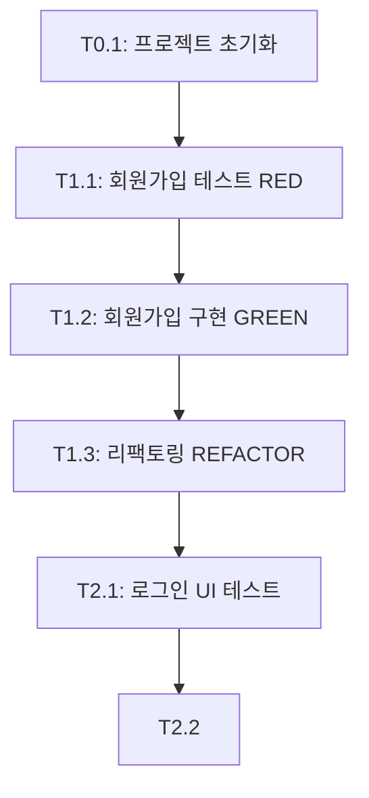

# Tasks Generator: TDD Task Breakdown Automation

Converts planning documents into TDD-compliant task lists with proper phase numbering and Git Worktree strategy.

## What is Tasks Generator?

Tasks Generator reads your planning documents (PRD, TRD, User Flow, Database Design, Design System) and automatically creates a structured **TASKS.md** file with:
- **TDD workflow**: RED → GREEN → REFACTOR cycle
- **Phase numbering**: Phase 0 (main branch) vs Phase 1+ (worktrees)
- **Milestone breakdown**: Clear milestones with dependencies
- **Parallel execution tracking**: Which tasks can run simultaneously

## How It Works

### Automatic Trigger (Recommended)

Tasks Generator is **automatically called** by the `socrates` skill after generating planning docs:

```
socrates (21 questions) → 6 docs → tasks-generator → TASKS.md
```

You don't need to do anything! After Socrates completes, Tasks Generator will run.

### Manual Trigger

If you already have planning docs and want to regenerate TASKS.md:

```
Say: "TASKS.md 만들어줘"
```

### Workflow Steps

1. **Read Planning Docs**:
   - `docs/planning/01-prd.md` → Extract features
   - `docs/planning/02-trd.md` → Confirm tech stack
   - `docs/planning/03-user-flow.md` → Structure milestones
   - `docs/planning/04-database-design.md` → Identify DB tasks
   - `docs/planning/05-design-system.md` → Reference UI components

2. **Apply TDD Rules**:
   - Phase 0: Setup tasks (direct to main)
   - Phase 1+: Feature tasks (Git Worktree + TDD)

3. **Generate TASKS.md**:
   - Creates `docs/planning/06-tasks.md`
   - Includes MVP capsule, milestones, phased tasks, dependency graph

## TDD Workflow

### Phase 0: Setup (Main Branch)

**No tests yet**. Just configuration and initialization.

```markdown
## Phase 0 (Main Branch)

### T0.1: 프로젝트 초기화
- [ ] Git 저장소 초기화
- [ ] 의존성 설치
- [ ] 환경 변수 설정 (.env)
- [ ] 데이터베이스 마이그레이션 초기화
```

**Branch**: Work directly on `main`. No worktree needed.

### Phase 1+: Features (Git Worktree)

**TDD cycle enforced**: Write tests first, then implement, then refactor.

```markdown
## Phase 1 (Worktree: backend-auth)

### T1.1: 회원가입 API 테스트 작성 (RED)
- [ ] POST /api/auth/register 테스트
- [ ] 입력 검증 테스트
- [ ] 중복 이메일 테스트

### T1.2: 회원가입 API 구현 (GREEN)
- [ ] 회원가입 엔드포인트 구현
- [ ] 비밀번호 해싱 (bcrypt)
- [ ] JWT 토큰 발급

### T1.3: 리팩토링 (REFACTOR)
- [ ] 중복 코드 제거
- [ ] 에러 처리 개선
- [ ] 코드 리뷰 반영
```

**Branch**: Create isolated worktree:
```bash
git worktree add ../backend-auth-worktree -b backend-auth
cd ../backend-auth-worktree
# Work here
```

## Phase Numbering Strategy

| Phase | Git Strategy | Test Requirement | Example Tasks |
|-------|-------------|------------------|---------------|
| **Phase 0** | Main branch | ❌ No tests | Setup, config, migrations |
| **Phase 1** | Worktree: `backend-auth` | ✅ Tests required | Authentication API |
| **Phase 2** | Worktree: `frontend-auth` | ✅ Tests required | Login/Register UI |
| **Phase 3** | Worktree: `feature-chat` | ✅ Tests required | Chat functionality |

**Why Worktrees?**
- **Parallel work**: Backend and frontend teams can work simultaneously
- **Isolation**: Changes don't interfere with each other
- **Clean history**: Each feature has its own branch

## TASKS.md Structure

### 1. MVP Capsule (10-Point Summary)
```markdown
## MVP Capsule

1. **핵심 가치**: 실시간 팀 채팅으로 협업 효율 향상
2. **타겟 유저**: 10-50인 스타트업 팀
3. **주요 기능**: 채널 기반 메시징, 파일 공유, 멘션
...
```

### 2. Milestone Overview
```markdown
## Milestone Overview

- **M0**: 프로젝트 초기 설정 (Phase 0)
- **M1**: 백엔드 인증 시스템 (Phase 1)
- **M2**: 프론트엔드 인증 UI (Phase 2)
- **M3**: 채팅 핵심 기능 (Phase 3-5)
- **M4**: 배포 및 모니터링 (Phase 6)
```

### 3. Phased Tasks
```markdown
## Phase 1 (Worktree: backend-auth)

### T1.1: 회원가입 API 테스트 (RED)
- [ ] Task 1
- [ ] Task 2

### T1.2: 회원가입 API 구현 (GREEN)
- [ ] Task 1
- [ ] Task 2

### T1.3: 리팩토링 (REFACTOR)
- [ ] Task 1
- [ ] Task 2
```

### 4. Dependency Graph (Mermaid)
```markdown
## Dependency Graph


```

## Integration with Other Skills

### Socrates → Tasks Generator
```
User: "기획해줘"

Socrates:
- 21 questions
- Generates 6 docs (PRD, TRD, User Flow, DB, Design, Coding)

↓ Auto-triggers

Tasks Generator:
- Reads 6 docs
- Generates TASKS.md with TDD rules
```

### Manual Re-generation
```
User: "TASKS.md 다시 만들어줘"

Tasks Generator:
- Re-reads docs/planning/
- Overwrites docs/planning/06-tasks.md
- Updates with latest planning changes
```

## When to Use Tasks Generator

**Use Tasks Generator when**:
- ✅ You have planning docs in `docs/planning/`
- ✅ You want TDD-structured task breakdown
- ✅ You're using Git Worktree strategy
- ✅ You need parallel backend/frontend work planned

**Skip Tasks Generator when**:
- ❌ You prefer manual task management
- ❌ You don't use TDD workflow
- ❌ You have a different Git strategy (e.g., GitHub Flow without worktrees)

## Key Rules Enforced

### 1. Test-First for Phase 1+
```markdown
❌ Bad (Implementation before tests):
### T1.1: 회원가입 API 구현
- [ ] POST /api/auth/register 엔드포인트

✅ Good (Tests first):
### T1.1: 회원가입 API 테스트 (RED)
- [ ] POST /api/auth/register 테스트 작성
```

### 2. Worktree for Phase 1+
```markdown
Phase 0: main 브랜치
Phase 1: git worktree add ../backend-auth -b backend-auth
Phase 2: git worktree add ../frontend-auth -b frontend-auth
```

### 3. Parallel Tasks Marked
```markdown
### T2.1 & T3.1: 병렬 실행 가능
- T2.1 (Frontend Auth UI)
- T3.1 (Backend Chat API)

→ 두 팀이 동시에 작업 가능!
```

## Example Output

See a full example TASKS.md:
```bash
cat skills/tasks-generator/references/tasks-template.md
```

This 47KB template shows a complete chat app breakdown.

## File Structure

```
skills/tasks-generator/
├── SKILL.md              # Full skill definition (174 lines)
├── README.md             # This file
└── references/
    └── tasks-rules.md    # Core rules for task generation
```

## FAQ

### Q: Can I edit TASKS.md after generation?
**A**: Yes! TASKS.md is just a guideline. Edit it to match your workflow.

### Q: What if I don't want Git Worktrees?
**A**: You can manually adjust the workflow. Tasks Generator is opinionated but not enforced by tooling.

### Q: How do I mark tasks as complete?
**A**: Check the `[ ]` boxes in TASKS.md. Change `[ ]` to `[x]`.

### Q: Can I regenerate TASKS.md?
**A**: Yes. Say "TASKS.md 다시 만들어줘" and it will overwrite the file.

## Next Steps After Tasks Generator

After TASKS.md is created:

1. **Review Tasks**: Check `docs/planning/06-tasks.md`
2. **Setup Project**: Use `project-bootstrap` to generate code structure
3. **Start Phase 0**: Complete setup tasks on main branch
4. **Create Worktree**: For Phase 1, create your first worktree:
   ```bash
   git worktree add ../backend-auth -b backend-auth
   cd ../backend-auth
   # Start T1.1 (RED phase)
   ```

---

**For more details**, see [SKILL.md](./SKILL.md) (full specification)

**For complete skills overview**, see [../../SKILLS.md](../../SKILLS.md)
